# A Comprehensive Review of Various AI‑Based Segmentation Algorithms for Multiscale Rocks: Principles, Evaluations, Simple Applications and Future Directions

Zhi Zhao1 $\cdot$ Xiao‑Ping Zhou1,2

Received: 13 March 2025 / Accepted: 15 May 2025 / Published online: 16 June 2025   
$\circledcirc$ The Author(s), under exclusive licence to Springer-Verlag GmbH Austria, part of Springer Nature 2025

# Abstract

With the rapid development of modern digital imaging techniques, it is possible to obtain big data to evaluate various properties of rocks across disparate scales. Various machine learning (ML) and deep learning (DL) algorithms have emerged as one of the most efective ways to analyze big data from rock digital images. The rock engineering feld has witnessed the rapid developments of ML and DL algorithms, which provide large analysis data of rocks to enable researchers to solve various rock engineering problems. Meanwhile, the existing knowledge of rock problems can also develop and enlarge novel ML and DL methods. Thus, it is imperative to select and employ advanced ML and DL algorithms to diferent rock engineering problems. The purposes of this review are to clearly defne the multiscale analysis of rocks, to provide a comprehensive review of the concept and model evaluations with diferent metric indexes of ML and DL algorithms, and to elucidate their applications on the petro-physical parameter evaluations, realistic 3D modeling, and cracking behaviors as well as failure mechanism analyses of multiscale rocks. In addition, the challenges and future directions of the rapidly developing ML and DL algorithms are also discussed.

# Highlights

• The segmentation terms in rock digital analysis framework are normalized defned • Evaluations and applications of various AI segmentation algorithms are elucidated. • Future directions of AI segmentation techniques are suggested for multiscale rocks.

Keywords Machine and deep learning segmentation techniques $\cdot$ Rock digital images $\cdot$ Multiscale rocks $\cdot$ Model evaluations $\cdot$ Cracking behaviors and failure process

# 1 Introduction

Rock digital image segmentation (RDIS) techniques, as one of the digital rock analysis techniques, play crucial roles in various engineering fields such as geology, mineralogy, petroleum engineering, energy-resource engineering, geotechnical engineering, and environmental engineering (Cnudde and Boone 2013; Zhao and Zhou 2024; Zhao et al. 2024a, b). Accurate and efcient segmentation of various rock structures from various two dimensional (2D) slices or three-dimensional (3D) radiographic images is vital for extracting signifcant and valuable information. The information is crucial for various engineering programs during the planning, design, implementation and monitoring procedures, to avoid safety and stability problems, such as tunnel collapse (Sun et al 2018), landside hazard (Nichol, 2006), $\mathrm { C O } _ { 2 }$ and nuclear waste leakages (Govindan et al. 2011; Patel et al. 2023), and mining well integrity failure (Mohammed, 2019). The signifcance and applications of digital image segmentation techniques for multiscale rocks can be summarized as follows.

Multiscale conventional petro-physical property analysis: RDIS makes it possible to obtain the microscopic mineral components and microstructures, enabling researchers to precisely determine the properties of rock masses, such as the porosity, pore connectivity, thermal conductivity, fuid saturation, elastic modulus and permeability (Zhao et al. 2022a, 2022b, 2024a, 2024b).. These petro-physical parameters are crucial for the thermal, hydraulic and mechanical property evaluations.

Advanced integration techniques: RDIS can be considered as a foundational procedure to integrate deep and machine learning algorithms with advanced data acquisition technologies such as LiDAR and remote sensing (Zhou et al. 2004; Mehmood et al. 2022). Thus, researchers can conduct geological analyses with higher accuracy and efciency to provide informed decisions and innovative solutions for various engineering difculties.

Realistic 3D modeling of various rocks: RDIS can provide realistic mineral components and topologies of rocks to make it easier to construct numerical models with realistic microstructures for numerical simulations and management strategies (Zhao and Zhou 2019; Liu et al. 2020), which plays signifcant roles in selecting suitable drilling and production techniques, and determines optimal reservoir development schemes.

Resource explorations and extractions: Accurate segmentation of rock formations can provide identifed potential minerals or hydrocarbon deposits in mining and petroleum felds (Jahanbakhsh et al. 2020; Purswani et al. 2020). With the help of various rock types and structures, researchers can determine optimal exploration schemes to fnd valuable resources more efectively, and provide efective extraction strategies to minimize environmental efects.

Geotechnical infrastructure constructions: Accurate segmentation makes great contributions to the design and constructions of geotechnical infrastructures such as various bridges, concrete roads, deep tunnels and river dams (Yang and Buenfeld 2001; Tang et al. 2020; Fu et al. 2021). Through precise segmentation of rocks, researchers can fully study geological challenges, provide suitable optimization structures to satisfy the safety and longevity demands of geotechnical infrastructures under diferent engineering and geological conditions.

Environmental monitoring and management: Rock segmentation contributes to evaluate the environmental efects of geological processes such as erosion, weathering and sedimentation (Pickup and Marks 2000). By monitoring rock formation changes over time, researchers can determine areas prone to degradation, provide conservation schemes and decrease natural geological disaster risks, such as landslides, rock falls, coastal erosion and river dam collapse (Zhang et al. 2020a, b).

Risk assessments and decision-makings: RDIS can provide reliable information of damage and crack regions for geotechnical constructions or reservoirs, which helps decision-makers to conduct risk assessments and mitigation schemes (Aven 2016). Thus, detailed information on rock formations via segmentation techniques play a signifcant role in making informed decisions and avoids potential hazards in various engineering projects, such as the analyses of construction project feasibility, slope stability and mining operation safety (Duan et al. 2020; Pi et al. 2021).

In total, reliable rock segmentations play indispensable roles in various engineering applications, which can provide critical insights for informed decision-makings, optimal utilizations of various resources and reduction of geological risks. Its importance strengthens the ongoing eforts and developments aiming at studying advanced segmentation techniques, which is integrated with emerging technologies to provide solutions for evolving challenges faced by the engineering community.

Briefy, segmentation techniques can be simply divided into classical segmentation algorithms, and deep and machine learning algorithms (Rana and Bhushan 2023). On one hand, the former can be classifed into three categories, including the thresholding, edge detection and region growth segmentation algorithms (Shou et al. 2020), which has the following limitations: (1) requiring artifcial designs of diferent feature extraction procedures with lots of knowledge of digital image processing of rocks, which has low robustness and is sensitive to quality and noise of rock digital images; (2) inaccurate mineral components segmentations due to complicated textures and disorderly microstructures of rock digital images; and (3) lacking generalization capability due to re-designed parameters and segmentation algorithms for digital images of various types of rocks. On the other hand, machine learning (ML) and deep learning (DL) algorithms have emerged in recent years as powerful tools for automating RDIS tasks. Compared with classical segmentation algorithms, ML and DL-based segmentation algorithms have the following advantages (Liu et al. 2023a, b; Bellens et al. 2024): (1) various features such as the textures and structures can be automatically learned from a large amount of training dataset, which extremely decreases the demands of segmentation algorithms on rock digital image quality; (2) it has powerful modeling capabilities with accurate segmentation due to the efective recognition of complex spatial information and contextual relationships in rock digital images; (3) it has powerful transfer and generalization capabilities with more universal feature representations by training the dataset consisting of various digital images from diferent types of rocks; and (4) it has the capability of end-to-end learning to directly obtain the segmentation results from the original input rock digital images without the preprocessing and feature engineering procedures. Such capabilities of ML and DL-based segmentation techniques have validated the great potential to study the multiscale behaviors and complicated phenomena related to various rocks.

Based on the above considerations, this review aims to provide a comprehensive overview of the ML and DL-based segmentation algorithms used in digital rock image analysis, to highlight their applications and to discuss recent advancements in this field. The present article mainly pays attentions to the key analyses of the model evaluations and applications of ML and DL-based segmentation algorithms on the multiscale rocks, in which (1) the segmentation terms such as “multiscale” and “material-structure phase” in the analysis framework of rock digital images are defined, (2) the model evaluations and application of various ML and DL-based segmentation algorithms are clearly elucidated, and (3) the challenges and future directions of DL and ML-based segmentation techniques are suggested for multiscale rocks.

# 2 Digital Characterizations of Multiscale Rocks

# 2.1 Defnitions of Segmentation Terms

In the digital image analysis framework, the segmentation terms containing the “material-structure phase” and “multiscale” are defned to clearly distinguish various characteristics of rocks under diferent scales and to exhibit different representations of diferent materials with diferent structures and topologies. These terms would be useful if researchers would accept and utilize these defnitions, which can add clarity and reduce contradictions during communication and study processes.

The term “material-structure phase” in the digital image analysis framework is defned as the diferent structures with diferent materials under diferent imaging resolutions, which can be classifed as the following terms (Fig. 1).

Solid matrix phase: It is defned as the mineral aggregate, which is considered to be a solid phase, in which diferent minerals cannot be distinguished.

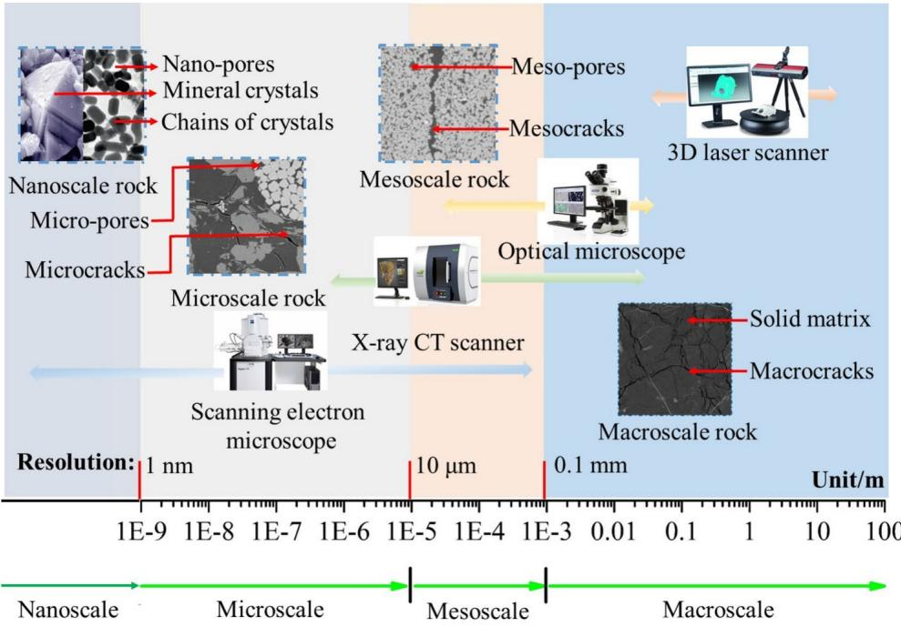  
Fig. 1 Imaging instruments and digital images of rocks under diferent scales, in which resolution represents the minimal size of pixel in images

Void phase: It is defned as the assemble consisting of various pores and cracks at diferent scales.

Macrocracks, mesocracks, microcracks and nanocracks: It is defned as the recognized crack phases at macroscale, mesoscale, microscale and nanoscale, respectively.

Meso-pores, micro-pores and nano-pores: It is defned as the recognized pore phase at mesoscale, microscale and nanoscale, respectively.

The term “multiscale” in the digital image analysis framework is defned as the imaging resolution that can exhibit the diferent morphology characteristics of structures to mineral components of rocks, which can be divided into the following scales.

Macroscale: In this scale, the macroscopic morphology characteristics can be revealed before the smallest feature structure (e.g. unifed solid matrix phase and void phase) under this imaging resolution, and the imaging resolution is suggested to be larger than $0 . 1 \mathrm { m m }$ .

Mesoscale: In this scale, the mesoscopic morphology characteristics can be revealed as the unifed solid matrix phase and void phase under this imaging resolution, and the imaging resolutions are suggested from $0 . 1 \ \mathrm { m m }$ to $1 0 \mu \mathrm { m }$ .

Microscale: In this scale, the microscopic morphology characteristics can be revealed as the separate grain phase and pore phase under this imaging resolution, and the imaging resolutions are suggested from $1 0 \mu \mathrm { m }$ to $1 \mathrm { n m }$ .

Nanoscale: In this scale, the morphology characteristics can be revealed below the largest separate grain phase and pore phase under this imaging resolution, and the geometry morphology of grain phase and pore phase even the molecule or atom structures can be recognized with the suggested imaging resolutions being less than $1 \ \mathrm { n m }$ .

# 2.2 Data Acquisition Methods of Multiscale Rocks

With the rapid development of modern digital imaging techniques, various rock digital image data acquisition methods are applied, which can be simply classifed into the following four types (Fig. 1).

Optical microscope (OM) imaging: This type of imaging technique is applied to obtain the digital images of rock thin section through the objective lenses under different magnifcations (Mertz 2019). It can obtain rock digital images from microscale to mesoscale with higher resolution, which enables to study rock details, but can only obtain 2D digital images of rock thin sections.

Scanning electron microscope (SEM) imaging: This type of imaging technique mainly focuses on the surface of rock samples, and can be classifed into focused ion beam (FIB-SEM), broad ion beam (BIB-SEM), secondary electrons (SE-SEM) and backscatter electrons (BSESEM) imaging techniques according to diferent beam and imaging principles (Ural 2021). It has the ability to provide 3D topographic information on microstructures and mineral components from nanoscale to microscale. Generally, the conventional SEM imaging techniques can only observe the local surface morphology, without the ability to provide overall 3D structure information of rocks. Although this point can be replenished at a certain degree through scanning diferent thin sections from different locations of the same rock sample, it still lacks continuous 3D structure information of rocks (Liu et al. 2022).

$\mathbf { X }$ -ray computed tomography (CT) imaging: This type of imaging technique has the abilities of non-destructive and real-time monitoring, internal structure observation, and 3D visualizations of rocks from microscale to macroscale, which is extensively applied in various engineering felds such as oil–gas engineering and rock engineering felds (Wennberg and Rennan 2018). It can provide 2D and 3D information on the pore phase, crack phase and minerals at diferent scales by using diferent imaging resolutions.

Optical 3D scanning imaging: This type of imaging technique has the capability of obtaining the surface information of rocks at the macroscale from millimeter level to meter level by using various apparatuses such as laser, structure light, LiDAR and remote sensing devices (Kus 2015). It has the advantages of fast imaging and

covering large regions of rock mass. However, it cannot provide the internal structures of rock masses (Singh et al. 2023).

In total, using the above-mentioned four types of modern imaging techniques and corresponding instruments, multiscale rock digital images can be efectively obtained, which can be further applied to provide comprehensive study of various thermal, hydraulic and mechanical responses of engineering problems related to rocks, such as deep reservoir rock engineering and oil–gas engineering.

# 2.3 Rock Feature Extractions

Rock features are representative information to characterize special or important elements in rock digital images, including spectrum, texture and structure features. The feature extraction procedures based on diferent rock features under diferent scales can be considered as the fundamental step for the RDIS process in various segmentation algorithms, which is classifed into the following four classifcations.

Spectrum features: It is applied to determine the chemical compositions and mineralogical properties of rocks by analyzing the color, refectance and absorption parameters of multispectral or hyperspectral imaging data of rocks, which can be represented by various spectral descriptors such as band ratio, spectral indices and principal component analysis (Jollife 2002; Chang 2003; Van der Meer 2006).

Texture features: It is applied to analyze the pixel or voxel intensity values to obtain the spatial distributions and statistical properties of rocks to characterize the information of roughness, homogeneity and complexity of rocks, which can be represented by various feature descriptors such as gray level co-occurrence matrix, local binary patterns, Gabor flters and fractal dimensions (Haralick et al. 1973; Mandelbrot 1982; Ojala et al. 2002). Structure features: It is applied to characterize rock geometric structures by shape, size, spatial distribution of diferent mineral and pore phases in rocks, which can be determined by diferent techniques, such as edge detection and morphological operations (Canny 1986; Soille 2013), to quantitatively represent rock structures by different parameters (e.g. area, perimeter and circularity) (Gonzalez and Woods 2008).

Multiscale features: It is applied to integrate local and global characteristics from diferent scales, which allows to exhibit of the complex and hierarchical natures of rocks. The multiscale feature can be determined by multiple resolution analysis techniques such as wavelet transforms (Mallat 1989) and is the fundamental part for segmentation and 3D reconstruction procedures of complicated rocks at diferent scales.

Clearly, these extracted features can not only provide lots of descriptors characterizing the mineral compositions, textures and structures of rocks but also serve as input data for segmentation procedures of rocks.

# 3 Machine Learning‑Based Segmentation Techniques of Multiscale Rocks

ML algorithms have the functions of regression, clustering and classifcation, which extremely depends on extracted features, such as color, texture and structure descriptors, to classify rock pixels or regions of interest (ROIs) of various materials. ML algorithms can usually be simply classifed into the following types based on diferent learning models and manners, as shown in Fig. 2.

# 3.1 Supervised Learning Techniques

Supervised learning techniques are common algorithms extensively applied for the prediction and classifcation of new dataset by learning the corresponding patterns and rules to establish the relations between input and output from pre-labeled training datasets. Generally, supervised learning techniques can be divided into regression algorithms and classifcation algorithms (Fig. 2). The former is usually applied to predict the continuous output variables such as linear regression (Yilmaz et al. 2007), Naïve Bayes (Huang et al. 2024) and K-nearest neighbors algorithms (Lepistö et al. 2006). The latter is primarily applied to conduct the classifcation and structural prediction tasks, and it mainly contains logistic regression (Schlögel, 2018), decision trees (Liu and Zhang, 2008), random forest (RF) (Purswani et al. 2020), support vector machine (SVM) (Zhao and MacKay 2020) and neural networks (Singh et al. 2010). Here, the common and typical supervised learning algorithms extremely related to RDIS are studied, in which their models and applications are evaluated in detail.

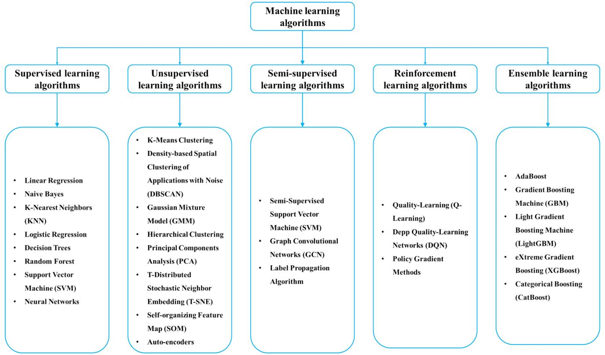  
Fig. 2 Various types of ML algorithm

Logistic regression-based DRIS: It serves as binary classifcation of DRIS, by

considering every pixel as an individual point and predicting its probability, to determine which phase the pixel belongs to by the logistic function or sigmoid function $( S _ { l o g i s t i c } )$ with a threshold value (Lavalley 2008). It is expressed as

$$
S _ { l o g i s t i c } ( x ) = \left[ 1 + e ^ { - x } \right] ^ { - 1 }
$$

The logistic regression-based DRIS has the advantages of simplicity, high efciency and robustness. It enables researchers to understand and implement the segmentation procedure easily due to its simple and interpretable network, low computational complexity and powerful processing ability of noise and incomplete data. However, it is also limited to the multiclass segmentation and representation of complicated rock structures due to intricate or overlapping structures, since it may not obtain complete rock information when artifcially adjusting the threshold to determine the probability of features for the rock segmentation tasks (Sperandei 2014).

Decision trees and RF-based DRIS: Decision trees and RF methods can be applied both for classifcation and regression works, in which the RF algorithms consist of multiple decision trees (Kotsiantis 2013), as shown in Fig. 3a. Once the extracted features such as color, texture and structure descriptors are trained in the decision trees and RF methods, the segment results of rock digital images with diferent rock classes can be obtained through traversing the trees by decision trees methods or aggregating the predictions from the individual decision trees by RF methods. In fact, decision trees algorithms can be considered as special cases of RF method. Decision trees have the advantages of providing interpretable rules and decision paths, removing artifacts and imperfection data, capturing non-linear relationships between features and class labels, and identifying the most discriminative features during the segmentation procedures of rock digital images. Nevertheless, decision trees are limited to be prone to overftting, low generalization and low computing efciency for large-scale rock digital images (Charbuty and Abdulazeez 2021). Fortunately, RF methods have further solved these problems. However, it may cause other problems such as expensive computation cost, imbalance classifcation and hyperparameters sensitivity due to inaccurate optimal algorithms and hyperparameters tuning (Yan et al. 2024).

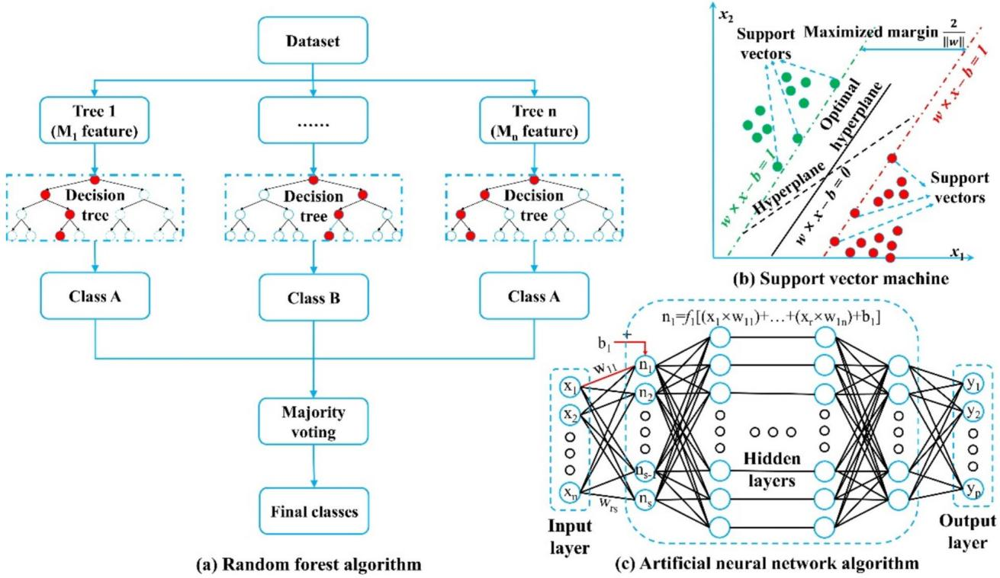  
Fig. 3 a Random forest algorithm, b Support vectors and c artifcial neural network algorithm

Support vector machine-based DRIS: SVM algorithms (Fig. 3b) are frst proposed by Cortes and Vapnik (1995) to solve the classifcation and regression problems without any parameterizations and assumptions for the true distribution of data. It can predict the output data from the input data to complete the classifcation performance much easier by determining the boundary due to its advantages of high fexibility, robustness, generalization ability reducing overftting risk, and ability to handle high-dimensional data (Krell 2018). The common SVM algorithms can be classifed into SVM with translational invariant kernels (Ghiasi-Shirazi and Safabakhsh, 2010), SVM with hard or soft margins (Wu and Zhou 2005; Brooks 2011), SVM with K-nearest neighbor (Raikwal and Saxena 2012) and SVM with radial basis functions (Wang et al. 2018), in which the core of the SVM algorithms is to minimize the following objective function

$$
\begin{array} { c } { { 0 . 5 \sum _ { i , j = 1 } \left( a _ { i } - a _ { i } ^ { * } \right) \left( a _ { j } - a _ { j } ^ { * } \right) k \left( x _ { i } , x _ { j } \right) } } \\ { { + \varepsilon \sum _ { i = 1 } \left( a _ { i } + a _ { i } ^ { * } \right) - y _ { i } \sum _ { i = 1 } \left( a _ { i } - a _ { i } ^ { * } \right) } } \end{array}
$$

where $\mathbf { k }$ denotes the positive-define kernel function, and Eq.  (2) is constrained by $\begin{array} { r } { \sum _ { i = 1 } ^ { n } \left( a _ { i } - a _ { i } ^ { * } \right) = 0 } \end{array}$ and $a _ { i }$ , $a _ { i } ^ { * } \in [ 0 , C ] ,$ in which $a _ { i } , a _ { i } ^ { * }$ are respectively the model parameters, and $C , \varepsilon$ are respectively the smoothness and precision approximation functions.

SVM-based RDIS provides a fexible and robust method to segment rock digital images. However, it is still limited to high computation cost, kernel function selection and data imbalance problems, which implies the accuracy and efciency constraints of SVM-based RDIS techniques.

Artifcial neural network-based DRIS: Artifcial neural network (ANN)-based DRIS (Fig. 3c) methods are computation models containing input, hidden and output layers consisting of numerous “neurons” (Zou et al 2009). It can be trained to conduct the segmentation performances of rocks by different learning patterns and predictions through a nonlinear, parameterized and bounded function. In the ANN framework, there exists the linear function and nonlinear transform function (taking the Gaussian radial basis function as an example) to parameterize input variables. Thus, the output can be respectively obtained as

$$
y = f { \Big ( } { \sum _ { i = 1 } ^ { n } w _ { i } x _ { i } + b } { \Big ) }
$$

$$
y = \mathrm { e x p } \left( - \sum _ { i = 1 } ^ { n } { \frac { \left( x _ { i } - \nu _ { i } \right) ^ { 2 } } { 2 b _ { 0 } ^ { 2 } } } \right)
$$

where $x _ { i }$ , $w _ { i }$ , $\nu _ { i }$ are respectively the input variable, weight, multivariate normal distribution coordinates, and $b$ and $b _ { 0 }$ are respectively the bias as a random number and bias parameter assumed along all directions.

The ANN model training is another important computation process by utilizing various optimization algorithms, which is applied to determine the gap between the input and output variables by loss functions through updating weight and bias parameters. The backpropagation is the most efective method to train an ANN model of RDIS, which contains the stages of computing output data from input data by feedforward pass, associated error backpropagations, and weights and bias parameters update (Rumelhart et al. 1986). During the computation process of the ANN model, the diference between the output and real values for each neuron node $k$ is controlled by the loss function, which is mathematically expressed as

$$
\Psi _ { \mathrm { k } } = { \frac { \partial L o s s { \big ( } y _ { k } , { \hat { y } } _ { k } { \big ) } } { \partial { \hat { y } } _ { k } } } l _ { k } ^ { \prime } { \big ( } a _ { k } { \big ) }
$$

where $\Psi _ { k }$ , Loss, $y _ { k } , \hat { y } _ { k }$ , $a _ { k }$ and $l _ { k }$ are respectively, the difference, loss function, real value, predicted value, sum of weights or activation function input and activation function for the $\mathbf { k }$ -th output node.

Considering these cases in the intermediate prior layer and repeating it until all the computations of the input layer are completed, the derivative values between the loss function and activation function input for the $j$ -th node, and between the forward pass computation result $\Psi _ { f o r w a r d } ^ { j }$ and backward pass computation result Ψj �ba $\Psi _ { b a k c w a r d } ^ { j ^ { \prime } }$ for the weight values $w$ from $j$ -th to $k$ -th node with the gradient descent update parameters can be respectively expressed as

$$
\Psi _ { j } = l _ { j } \prime \bigl ( a _ { j } \bigr ) \sum _ { k } \Psi _ { k } w _ { k j }
$$

$$
\frac { \partial L o s s } { \partial w _ { j j ^ { \prime } } } = \Psi _ { f o r w a r d } ^ { j } \Psi _ { b a c k w a r d } ^ { j ^ { \prime } }
$$

$$
w _ { j j ^ { \prime } } ^ { t } = w _ { j j ^ { \prime } } ^ { t - 1 } - \eta \frac { \partial L o s s } { \partial w _ { j j ^ { \prime } } ^ { t - 1 } }
$$

where $\eta$ denotes the learning rate to control how to adjust the weight related to the obtained loss gradient.

There exist various methods to adjust the weight related to the obtained loss gradient, which contains the most widely applied method by combining the stochastic gradient descent (SGD) and batch gradient descent (BGD) methods, AdaGrad, AdaDelta, RMSprop and Adam algorithms (Kingma and Ba 2014; Ruder 2016; Haji and Abdulazeez 2021), Thus, the ANN models have the capabilities to automatically learn various useful features, to eliminate manual feature extraction, to deal with small dataset problems, and to associate memories (Sharma et al 2008; Borders et al. 2016). However, it still has limitations of expensive computation cost for large dataset, essential model selection and hyperparameter tuning, and remanding a large amount of labeled training datasets for optimal segmentation of rock digital images.

In total, supervised learning segmentation techniques of rock digital images have the advantages of containing specifc objective functions and training methods, enabling the optimization parameters of various learning models, analyzing signifcant roles with reliable interpretability, having high prediction accuracy with enough marking data, and being prone to practical rock segmentation problems with plenty of algorithm library and tools. However, its disadvantages are also clear including that it remands marking data with high quality, is sensitive to noise and limited to generalization models with the need to consider the overftting problems, and cannot provide sufcient leaning and representation abilities for complicated non-linear problems.

# 3.2 Unsupervised Learning Techniques

Unsupervised learning techniques are a classifcation of algorithms without the need for pre-labeled training dataset. It has the capabilities of capturing potential and meaningful feature patterns and structures from input dataset for the functions of data explorations and visualizations, anomalous detections, product or systems recommendations and digital image segmentations. Generally, unsupervised learning techniques (Fig. 2) can be simply divided into the clustering methods for digital image segmentations including K-means clustering, density-based spatial clustering of applications with noise (DBSCAN), Gaussian mixture model (GMM) and hierarchical clustering algorithms (Kodinariya and Makwana 2013; Hou et al. 2016; Reynolds 2009; Murtagh and Conteras, 2012); and dimensionality reduction, anomalous detection and association rule mining methods including principal component analysis (PCA), T-distributed, stochastic neighbor embedding (T-SNE), self-organizing maps and autoencoders algorithms (Abdi and Williams 2010; Cieslak et al. 2020; Kohonen 1990Pinava et al., 2020). In this work, the common and typical unsupervised learning algorithms extremely related to RDIS are studied, in which their models and applications are evaluated in details.

K-means clustering algorithm: K-means clustering (KMC) algorithm is a centroid-based algorithm to divide the dataset into $k$ clusters by minimizing the sum of squared distances between the data points and corresponding cluster centroids (Fig. 4a), in which the data points are classifed into various clusters with the nearest mean (centroid) (Kodinariya and Makwana 2013). The expressions for the cluster centroid and Euclidean distance between data point $x _ { \mathrm { i } }$ and cluster centroid $u _ { \mathrm { j } }$ can be written as

$$
u _ { j } = { \sum _ { i = 1 } ^ { n } C _ { i } x _ { i } \mathord { \left/ { \vphantom { \sum _ { i = 1 } ^ { n } C _ { i } x _ { i } \mathord { \left/ { \vphantom { \sum _ { i = 1 } ^ { n } C _ { i } } } \right. \kern - delimiterspace } \sum _ { i = 1 } ^ { n } C _ { i } } } \right.}  \kern - delimiterspace } C _ { i } x _ { i } \mathord { \left/ { \vphantom { \sum _ { i = 1 } ^ { n } C _ { i } } } \right. \kern - delimiterspace } C _ { i }
$$

$$
C _ { i } = a r g m i n { \left( x _ { i } - u _ { j } \right) } ^ { 2 }
$$

where $C _ { \mathrm { i } }$ is the distance to classify the data point to the nearest cluster.

The KMC algorithm has the advantages of easily implementing and understanding, and producing compact and well-segmented clusters with high simplicity and efcacy (Ma et al. 2015). However, it is limited to be sensitive to initial selection of centroids and outliers, and local optimum problems (Maiti et al. 2021).

DBSCAN algorithm: The DBSCAN algorithm is a method to recognize or separate clusters in data with arbitrary shape and size based on the density (Fig. 4b). It has two indexes of epsilon (eps) characterizing the threshold of maximum distance between two points considered as neighbors, and minPts characterizing the minimum number of points for the eps-neighborhood with a point considered as a core point (Hou et al. 2016). In the DBSCAN algorithm, there exist three types of points including core, border and noise points in dataset $D$ within a eps $( \varepsilon )$ -neighborhood containing minPts samples at least, which must satisfy the following relations

$$
\left\{ \begin{array} { l l } { N _ { \varepsilon } ( p ) \geq m i n P t s } \\ { N _ { \varepsilon } ( p ) = \{ q \in D | d i s t ( p , q ) \leq \varepsilon \} } \end{array} \right.
$$

$$
b \in N _ { \varepsilon } ( p ) ; n \not \in N _ { \varepsilon } ( p )
$$

where $p , b , n$ and $N _ { \varepsilon } ( p )$ are respectively the core, border, noise points and $\varepsilon$ -neighborhood.

DBSCAN is a powerful density-based clustering algorithm, which can accurately separate clusters with arbitrary shape and size, and can deal with noise and outliers in the dataset. However, its performance relies extremely on the input parameter selections of eps and minPts, and it may face challenges in identifying clusters with varying densities and high-dimensional spaces (Walicka et al.,, 2018).

GMM algorithm: The GMM algorithm is a clustering algorithm based on a statistical model with generating data by assuming Gaussian distributions (Fig. 4c), in which the key is to fnd the best ftting parameters of GMM to characterize the observed data (Reynolds 2009). The GMM must defne the parameters including the initial mean, covariance and mixing proportions of Gaussian components with its number $K$ . The computation results of GMM can be obtained by repeating the expectation and maximization algorithm until the maximum iterations or parameters converge to

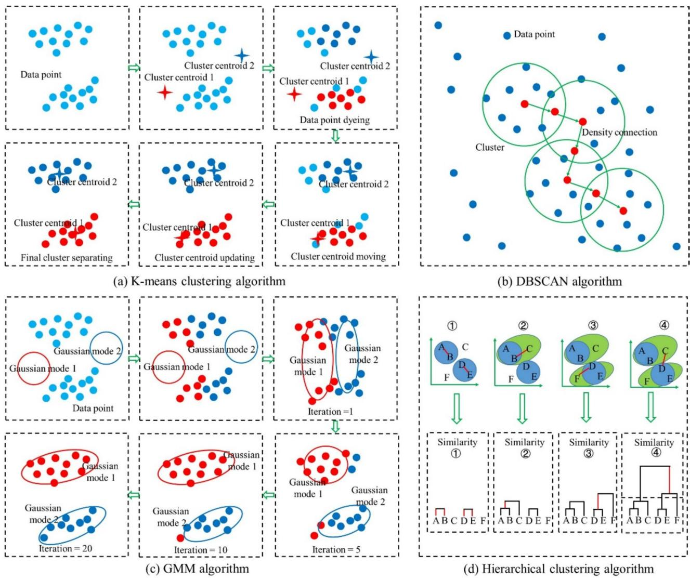  
Fig. 4 Sketch maps of a K-means clustering algorithm, b DBSCAN algorithm, c GMM algorithm and d Hierarchical clustering algorithm

$$
\gamma _ { i k } = \frac { \pi _ { k } N \big ( \boldsymbol { x } \big | \mu _ { k } , \sum \boldsymbol { k } \big ) } { \sum _ { k = 1 } ^ { K } \pi _ { k } N \big ( \boldsymbol { x } \big | \mu _ { k } , \sum \boldsymbol { k } \big ) }
$$

$$
\left\{ \begin{array} { l l } { \mu _ { k + 1 } = \frac { 1 } { \sum _ { i = 1 } ^ { N } \gamma _ { i k } } \sum _ { i = 1 } ^ { N } \gamma _ { i k } x _ { i } } \\ { \sum _ { k + 1 } ^ { 2 } = \frac { 1 } { \sum _ { i = 1 } ^ { N } \gamma _ { i k } } \sum _ { i = 1 } ^ { N } \gamma _ { i k } { \left( x _ { i } - \mu _ { k } \right) } ^ { 2 } } \\ { \pi _ { k + 1 } = \frac { \sum _ { i = 1 } ^ { N } \gamma _ { i k } } { N } } \end{array} \right.
$$

where $x _ { i } , k , N \big ( \boldsymbol { x } | \mu _ { k } , \sum k \big )$ and $\pi _ { k }$ are respectively, the sample �data, sequential number of component, $k$ -th component and its weight of every component.

The GMM algorithm has the advantages of handling outliers and noisy data more efectively and non-spherical clusters unlike K-means clustering assuming spherical clusters, and allowing for probability computations of cluster memberships by automatically determining the number of clusters (Wang and Sun 2022). However, its computation procedures are more expensive and complex than K-means clustering, and the Gaussian components $K$ should be preassigned. Thus, the GMM is sensitive to initial parameters and prone to local optimum problems.

Hierarchical clustering algorithm: Hierarchical clustering algorithm is a method of family clustering algorithms to create a tree-like structure to obtain the hierarchy clusters (Fig. 4d), in which every cluster belongs to the larger clusters at the higher levels (Murtagh and Conteras, 2012). It has the three key parameters containing the number of clusters, the linkage method to specify how to calculate the distance and the distance/similarity index to characterize the distance or similarity between clusters. There exist four types of distances to characterize the distance/similarity index between clusters, which can be expressed by the distance calculation $d _ { i j } = s q r t { \left[ \left( x _ { i } - x _ { j } \right) ^ { 2 } + \left( y _ { i } - y _ { j } \right) ^ { 2 } \right] }$ as follows:

$$
D _ { p q } ^ { s i n g l e - l i n k a g e } = \operatorname* { m i n } \left\{ d _ { i j } \bigg | x _ { i } \in G _ { p } , x _ { i } \in G _ { q } \right\}
$$

$$
D _ { p q } ^ { c o m p l e t e - l i n k a g e } = \operatorname* { m a x } \left\{ d _ { i j } \bigg | x _ { i } \in G _ { p } , x _ { i } \in G _ { q } \right\}
$$

$$
D _ { p q } ^ { m e a n - l i n k a g e } = \frac { 1 } { n _ { p } n _ { q } } \sum _ { x _ { i } \in G _ { p } } \sum _ { x _ { j } \in G _ { q } } d _ { i j }
$$

where Dsingle−linkage , Dcomplete−linkage , Dcentral−linkagepq and Dmean−linkagepq a re, respectively, the distance/similarity indexes of single, complete, central and mean likages; and ${ \cal G } _ { P } , { \cal G } _ { q } ,$ are, respectively, the clusters with the number of samples $n _ { p } ,$ $n _ { q }$ and mean values of $\overline { { x } } _ { p } , \overline { { x } } _ { q } .$ .

The hierarchical clustering algorithm also has some variants containing agglomerative NESting, balanced iterative reducing and clustering using hierarchies, clustering using representative, hierarchical K-means and divisive analysis algorithms (Shetty and Singh 2021). The hierarchical clustering algorithm has the advantages of dealing with various data types and cluster shapes, providing hierarchical representations of the data, allowing for fexible exploration and interpretation of the clustering results, but the choice of distance metric and linkage methods can signifcantly impact the fnal clustering outcome. (Wang et al. 2020).

In summary, unsupervised learning segmentation techniques of rock digital images have the advantages of discovering patterns from large-scale unlabeled data without the need of pre-labeled training data and uncovering unknown data structures and relationships with less artifcial efects, but their applications are limited due to relatively poor interpretability, careful selection of appropriate algorithms, lacking criterions of objective performance evaluations and problems by determining the optimal number of clusters and hyperparameters remanding extra experimentation and tuning.

# 3.3 Semi‑Supervised Learning Techniques

Semi-supervised learning techniques are a classifcation of methods lying between supervised and unsupervised learning techniques, which completes the training process better by simultaneously applying a small amount of labeled data and a large amount of unlabeled data to compensate for the limited labeled data caused by unlabeled data (Reddy et al. 2018). It can be simply divided into semi-supervised SVM, graph convolution networks and label propagation algorithms (Ding et al. 2017; Song et al. 2022; Cordasco and Gargano 2012), as shown in Fig. 2 and Fig. 5, which have been clearly elucidated in details.

Semi-supervised SVM: It is a classifcation of methods of extending algorithms according to the standard methods of supervised SVM, which can achieve better performances by utilizing a small amount of labeled data and a large amount of unlabeled data than SVM with limited labeled data (Ding et al. 2017), as shown in Fig. 5a. Semi-supervised SVM can be divided into transductive SVM, Laplacian SVM and entropy minimization SVM (Ding et al. 2017; Li et al. 2020), and transductive SVM is the best-known algorithm aiming at binary classifcation problems. During the computation process of semisupervised SVM, we frst assume the given labeled and unlabeled samples of $\mathbb { C } _ { l } = \left\{ { \left( x _ { 1 } , y _ { 1 } \right) } , { \left( x _ { 2 } , y _ { 2 } \right) } , \cdot \cdot \cdot , { \left( x _ { l } , y _ { l } \right) } \right\}$ and $\mathbb { C } _ { u } = \left\{ x _ { l + 1 } , x _ { l + 2 } , \cdot \cdot \cdot , x _ { l + u } \right\}$ with $l < < u$ , $l + u = N$ , $y _ { i } \in \{ - 1 , + 1 \} , i = 1 , 2 , \cdot \cdot \cdot , l$ . T h u s , to a ch i eve t h e predicted labels in the unlabeled sample $\mathbb { C } _ { u }$ o f $y = \left( y _ { l + 1 } , y _ { l + 2 } , \cdot \cdot \cdot , y _ { l + u } \right) ^ { T } , y _ { i } \in \{ - 1 , + 1 \} , i = l + 1 , l + 2 , \cdot \cdot \cdot _  \}$ $N$ , which must obey the following rules

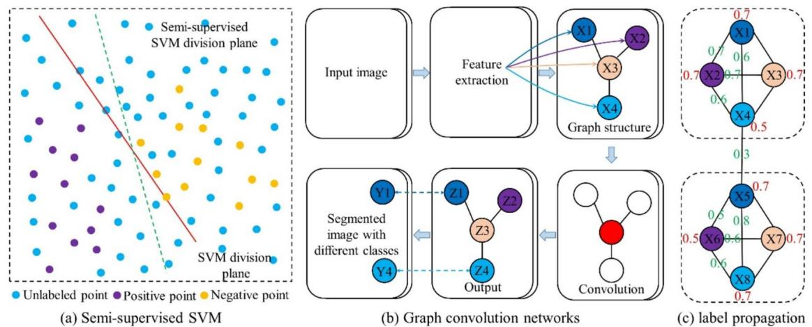  
Fig. 5 Sketch maps of a Semi-supervised SVM, b Graph convolution networks, and c label propagation algorithms

$$
\begin{array} { r } { \underset { w , b , \boldsymbol { y } , \boldsymbol { \zeta } } { \operatorname* { m i n } } 0 . 5 \| \mathbf { w } \| _ { 2 } ^ { 2 } + C _ { l } \sum _ { i = 1 } ^ { l } \zeta _ { i } + C _ { u } \sum _ { i = l + 1 } ^ { N } \zeta _ { i } } \end{array}
$$

$$
\begin{array} { r } { \left\{ \begin{array} { l l } { y _ { i } \big ( \mathbf { w } ^ { T } \mathbf { x } _ { i } + b \big ) \geq 1 - \zeta _ { i } , i = 1 , 2 , \cdots , l } \\ { Y _ { i } \big ( \mathbf { w } ^ { T } \mathbf { x } _ { i } + b \big ) \geq 1 - \zeta _ { i } , \left\{ \begin{array} { l l } { i = l + 1 , l + 2 , \cdots , N } \\ { \zeta _ { i } \geq 0 , i = 1 , 2 , \cdots , N } \end{array} \right. } \end{array} \right. } \end{array}
$$

where $( \mathbf { w } , b ) , C _ { l } , C _ { u }$ and $\zeta _ { \mathrm { i } }$ are respectively the divided super plane, specifed parameters for balancing the model complexity of labeled and unlabeled data, and relaxation vectors for labeled sample with $i = 1 , 2 , \cdots , l$ and for unlabeled sample with $i = l + 1 , l + 2 , \cdots , N$ .

Semi-supervised SVM can improve the abilities of supervised learning especially with sparse labelled data, decreases the labeling cost, deals with the class imbalance problems and improve the robustness of noise labels, but it has the limitations of being sensitive to underlying assumptions, which may lead to degraded performance, high computational complexity for large-scale computation problems, having difculties in hyperparameter tuning between labeled and unlabeled data to achieve optimal performance (Sun et al. 2022).

Graph convolution networks: Graph convolution networks (GCNs) are a classifcation of methods to work with graph-structured data, which is a type of generalization methods to deal with non-Euclidean data domains modifed from the similar structures of convolution neural networks (CNNs), containing the input of graph structure, stacked multiple convolution operations with localized graph with representations of its neighboring nodes and node itself, and fnal task-specifc layer for classifcation or regression problems (Song et al. 2022), as shown in Fig. 5b. In the GCNs framework, it is assumed that there exists a batch of graph data with $n$ nodes and each node has itself features. Thus, the graph structure input can be considered as the feature matrix $X$ with the dimension of $n \times d$ and the node relationship matrix $\pmb { A }$ . The convolution operation can be expressed as

$$
\mathrm { H } ^ { ( l + 1 ) } = \xi \big ( D ^ { - 0 . 5 } A D ^ { - 0 . 5 } \mathrm { H } ^ { ( l ) } W ^ { ( l ) } \big ) , A = A + I
$$

where $\mathrm { H } ^ { ( l ) } , \mathrm { H } ^ { ( l + 1 ) } , I , D , \xi$ and $\boldsymbol { W } ^ { ( l ) }$ are, respectively, the feature vector matrix at the current stage of $l$ layer, feature vector matrix after a convolution operation, unit matrix, the diagonal matrix of $A$ by $D = \sum A _ { i j }$ , non-linear active function such as RELU and trainable parameter matrix at current convolution operation.

GCNs have the advantages of capturing the complicated relationships between graph-structure data, high efficient convolution operations within a scalable process and leaning expressive node representations for both local and global graph structures, but it has challenges in efcient training model within large-scale graphs, dealing with graphs with various sizes and structures or dynamic graphs, and selecting appropriate designed graph convolution operations (Manessi et al. 2020; Bhatti et al. 2023).

Label propagation algorithms: Label propagation algorithms are the methods to segment unlabeled data by propagating label information from labeled data according to the underlying data structure expressed as graphs, which contains the graph construction step of data nodes and nodal edges created by a distance metric or kernel function to characterize the similarity or connectivity between data points, label initialization step with labeled data points by ground-truth labels and unlabeled data by assigning a special label for nodes, label propagation step of iteratively updating the labels of the unlabeled nodes until reaching the convergence or maximum number of iterations, and label assignment step of determining the labels of unlabeled nodes by the converged label values (Cordasco and Gargano 2012), as shown in Fig. 5c. During the label propagation process, the nodal labels can be updated by the synchronous updating or asynchronous updating, which are respectively expressed as

$$
C _ { x } ( t ) = f { \big [ } C _ { x _ { 1 } } ( t - 1 ) , C _ { x _ { 2 } } ( t - 1 ) , \cdots , C _ { x _ { k } } ( t - 1 ) { \big ] }
$$

$$
C _ { x } ( t ) = f { \biggl [ } C _ { x _ { i 1 } } ( t ) , \cdots , C _ { x _ { m } } ( t ) , C _ { x _ { i ( m + 1 ) } } ( t - 1 ) , \cdots , C _ { x _ { i k } } ( t - 1 ) { \biggr ] }
$$

where $C _ { x } ( t )$ and $f$ are respectively the label at node $x$ and the community with the maximum number of all communities for the selected node.

Moreover, the convergence condition is expressed as

$$
\{ \begin{array} { l l } { i f } & { i  ^ { l a b e l } l } C _ { m }  \\ { t h e n } & { d _ { i } ^ { C _ { m } } \geq d _ { i } ^ { C _ { j } } , \forall j } \end{array} 
$$

where $C _ { 1 } , \cdots , C _ { p }$ is the label of community, and $d _ { i } ^ { C _ { j } }$ is the number of label $C _ { j }$ at the neighbor community of node $i$ .

The common label propagation algorithms have diferent variants including the Gaussian felds and harmonic functions (GFHF), label spreading (LS), modifed adsorption (MAD) and local–global consistency (LGC) (El Kouni et al. 2020). Label propagation algorithms have the advantages of leveraging graph structure, semi-supervised learning, high simplicity and fexibility, but it has the limitations of graph construction and label noise sensitivity, low scalability due to computational complexity, low segment efciency of highly heterogeneous graphs, and lacking interpretability behind the label assignments (Zhang et al. 2020a, b).

In summary, semi-supervised learning segmentation techniques of rock digital images have the advantages of having better performance by employing unlabeled data to compensate for the limited labeled data, which can decrease the cost of data annotation, reduces the class imbalance issue and improves the robustness of training models. However, it has certain limitations of requiring empirical evaluations due to difculties of quantifying unlabeled data contributions, requiring better assumptions of unlabeled data distribution to perform better, and higher algorithmic complexity caused by simultaneous treatments of both labeled and unlabeled data.

# 3.4 Reinforcement Learning Techniques

Reinforcement learning techniques are methods to gradually learn and optimize the behaviors or schemes based on reward-punishment principle according to the feedback received from the environment, which can be simply divided into (Fig. 2) the Q-learning, deep Q-networks (DQN), and policy gradient algorithms (Hafz 2022; Stember and Shalu 2022; Yoo et al. 2021). In this work, the common and typical reinforcement learning algorithms extremely related to RDIS are studied, in which their models and applications are evaluated in detail.

Q-Learning algorithms: Q-learning algorithms are the model-free methods to fnd the optimal scheme (Q-function) to obtain the maximum expectation value of total remuneration during the Markov process (Fig. 6a), which contains the procedures of setting the initial state of $s$ , selecting an action based on the derived policy from Q-function, taking action $a$ and observing the reward $r$ and next state of $s ^ { \prime }$ , and updating the Q-function until the episode terminates (Hafz 2022). During the update procedure, its mathematical expression can be written as

$$
Q ^ { n e w } \bigl ( s _ { t } , a _ { t } \bigr ) \gets ( 1 - \alpha ) \times Q \bigl ( s _ { t } , a _ { t } \bigr ) + \alpha \times \Big \{ r _ { t } + \beta \times \operatorname* { m a x } _ { a } \left[ Q \bigl ( s _ { t + 1 } , a \bigr ) \right] \Big \}
$$

where $s , a , r _ { t } , \alpha$ and $\beta$ are respectively the state symbol, action symbol, feedback reward learning rate of $0 \sim 1$ and discount factor of $0 \sim 1$ .

The Q-learning methods of RDIS have some variants such as the deep Q-learning, double Q-learning, double deep Q-learning, delayed Q-learning and greedy GQ algorithms (Clifton and Laber 2020). These algorithms have the advantages of simple and efective implementation, no need of environment model and guaranteeing convergence of optimal Q-function and policy, but they are inevitably limited to the high-dimensional state and action spaces for storing problems of state-action pair, hyperparamters sensitivity and strong dependence on efcient exploration for optimal policy fnding problems (Qafou 2023).

Deep Q-networks (DQN): Deep Q-network is a classifcation of methods by combining Q-learning and convolution neural network algorithms. DQN utilizes the convolution neural network (Q-network) to compute the Q-function and minimize the mean squared error, and it also employs experiences replay to break the correlation between continuous samples, in which the experiences (state of $s _ { t } ,$ action of $\boldsymbol { a } _ { t } ,$ reward $\boldsymbol { r } _ { t , \mathrm { ~ } }$ next state $s _ { t + 1 }$ ) of agent are stored (Mnih et al. 2015), as shown in Fig. 6b, and the corresponding update procedure can be expressed as

$$
\left\{ \begin{array} { l l } { \displaystyle Q \big ( s _ { t } , a _ { t } , w \big ) \gets Q \big ( s _ { t } , a _ { t } , w \big ) + \alpha \Big \{ { r _ { t + 1 } + \beta \operatorname* { m a x } _ { a } \big [ Q _ { q } \big ( s _ { t + 1 } , a _ { t } , w \big ) \big ] - Q \big ( s _ { t } , a _ { t } , w \big ) \Big \} } } \\ { \Delta w = \alpha \Big \{ { r _ { t + 1 } + \beta \operatorname* { m a x } _ { a } \big [ Q _ { q } \big ( s _ { t + 1 } , a _ { t } , w \big ) \big ] - Q _ { q } \big ( s _ { t } , a _ { t } , w \big ) \cdot \nabla _ { w } Q _ { q } \big ( s _ { t } , a _ { t } , w \big ) \Big \} } } \end{array} \right.
$$

where $w$ is the weight value.

DQN has the advantages of have the capability to solve high-dimensional problems using deep neural networks with stable training, and improving sampling efciency due to experience replay and target network, but it is limited to high computation complexity due to the addition of deep neural networks for training process and it is also sensitive to hyperparameters selections such as discount factor (Stember and Shalu 2022).

Policy gradient algorithms: Policy gradient algorithms are methods to directly optimize the policy function rather than the value estimation function to obtain the probability of taking actions in a certain state of $s _ { t } ,$ and there exist three types of policy target function to maximize the performance index, which are respectively expressed as (Yoo et al. 2021; Hansel et al. 2021)

$$
\left\{ \begin{array} { l l } { \displaystyle { { J _ { 1 } } ( \theta ) = V ^ { \pi _ { \theta } } \left( s _ { 1 } \right) = E _ { \pi _ { \theta } } \left( \nu _ { 1 } \right) ; f o r e p i s o d i c ~ e n \nu i r o n m e n t } } \\ { \displaystyle { { J _ { a \nu } } \nu ( \theta ) = \sum _ { s } { d ^ { \pi _ { \theta } } ( s ) V ^ { \pi _ { \theta } } ( s ) } ; f o r ~ c o n t i n u o u s ~ e n \nu i r o n m e n t ~ w i t h ~ n o ~ i n i t i a l ~ s t a t e } } \\ { \displaystyle { { J _ { a \nu } } \nu ( \theta ) = \sum _ { s } { d ^ { \pi _ { \theta } } ( s ) \sum _ { s } { \pi _ { \theta } } ( s , a ) { r _ { s } ^ { a } } ; f o r ~ a \nu e r a g e ~ r e w a r d ~ p e r ~ t i m e - s t e p } } } \\ { \displaystyle { \vphantom { \sum _ { s } { d ^ { \pi _ { \theta } } ( s ) \sum _ { s } { d ^ { \pi _ { \theta } } ( s ) \sum _ { s } { d ^ { \pi _ { \theta } } ( s ) \sum _ { s } { d ^ { \pi _ { \theta } } ( s ) } } } } } } } \\ { \displaystyle { \vphantom { \sum _ { a \nu } { e ^ { a } } } } } \end{array} \right.
$$

where $\pi ( \cdot ) , V ^ { \pi _ { \theta } } , E , J , \theta , d ^ { \pi _ { \theta } } ( s )$ and $P$ are respectively the action, value function, expectation, performance index, policy parameter, static distribution of Markov chains and probability.

After determining the policy target function, the gradient ascent method is applied to solve the policy parameter $\theta$ , and the expression of the updating process can be written as

$$
\theta _ { t + 1 } = \theta _ { t } + \alpha \nabla J \big ( \theta _ { t } \big )
$$

Policy gradient algorithms also have some variants such as deep deterministic policy gradient, Monte Carlo-based policy gradient, baseline-based policy gradient and Actorcritic-based policy gradient algorithms (Yoo et al. 2021; Wang and $\mathrm { H u } 2 0 2 1$ ). These algorithms have the advantages of directly optimizing the policy function to make it suitable for problems with complicated action spaces and allowing for fexible policy representations with convergence guarantees, but they are inevitably limited to slower convergence due to its selection sensitivity of hyperparameters and high computation complexity due to difculties in optimal policy explorations (Sumiea et al. 2024).

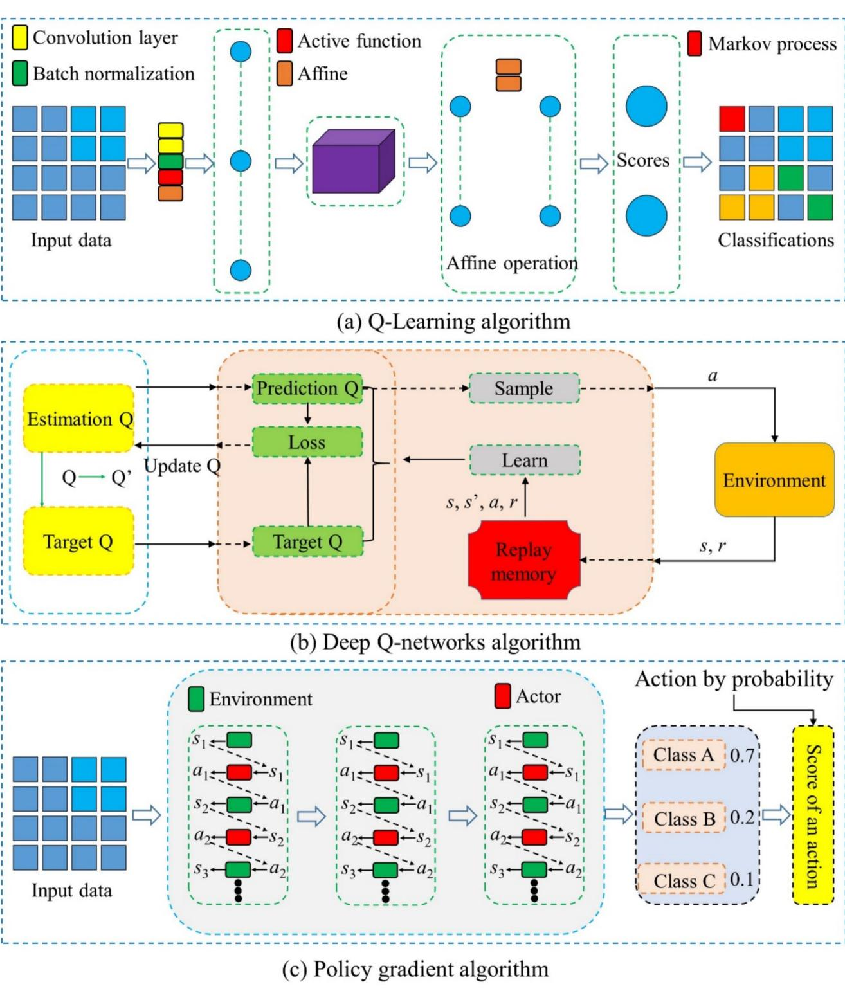  
Fig. 6 Sketch maps of a Q-Learning, b Deep Q-networks, and c Policy gradient algorithms

In summary, reinforcement learning segmentation techniques of rock digital images have the advantages of having high adaptability to learn optimal policy within various environments, solving complex problems that cannot be mathematically modeled, and having autonomous learning abilities to interact with the environment without the artifcial operations, but it has the limitations of low sample efciency due to the requirement of large amounts of training datasets, unstable training due to its difculty in computation convergence, and lacking interpretability due to the “black-box” design of desired behaviors.

# 3.5 Ensemble Learning Techniques

Ensemble learning technique is a classifcation of methods to establish the powerful computation model by combining multiple machine learning models, which improves its prediction accuracy and reduces the risk of overftting, and can be simply divided into bagging, boosting, stacking and blending algorithms. Here, the common and typical ensemble learning techniques of boosting algorithms extremely related to RDIS are studied including the gradient boosting machine (GBM), AdaBoost, lightGBM, XGBoost and CatBoost algorithms (Natekin and Knoll 2013; Ke et al. 2017; Azmi and Baliga 2020; Hancock and Khoshgoftaar 2020), as shown in Fig. 2, in which their models and applications are evaluated in details.

Gradient boosting machine (GBM): Gradient boosting machine is the method belonging to the boosting family of algorithms, which constructs the strong prediction model by iteratively adding multiple novel weak models (e.g. decision trees) to minimize the loss function to adjust errors from previous models (Natekin and Knoll 2013), as shown in Fig. 7a. GBM starts the computation process by assuming the decision trees-based weak models and training the residuals between the real and predicted values of previous models, and the weak model in the $m$ -th iteration can be written as

$$
\left\{ \begin{array} { l l } { F _ { m } ( x ) = F _ { m - 1 } ( x ) + \underset { h \in H } { \arg \operatorname* { m i n } } L o s s \big [ y _ { i } , F _ { m - 1 } \big ( x _ { i } \big ) + h \big ( x _ { i } \big ) \big ] } \\ { L o s s = \big [ y - F _ { m - 1 } ( x ) \big ] ^ { 2 } } \end{array} \right.
$$

where $x _ { i }$ and $y _ { i } , F _ { m } ( x )$ and $h ( x )$ are respectively the training sample, accumulative model and weak base learners.

Generally, GBM has the generalization abilities to form diferent algorithms by utilizing various loss functions, such as the L2Boosting with square loss function, BinomialBoost with log-loss function and AadBoost with exponential loss function (Lu and Mazumder 2020), and the decision tree-based GBM is the most common algorithm. GBM has the advantages of high prediction precision, dealing with various types of features with strong robustness for noise and outlines, and automatically choosing features by assigning high weights, but it is still limited to the complex computations with large datasets or large number of trees, hyperparameter tuning and lower interpretability caused by large number of base learners (Bentéjac et al. 2021).

AdaBoost: AdaBoost algorithm is a method similar to GBM, in which the loss function is changed to an exponential loss function (Wang 2012), as shown in Fig. 7b. In the framework of AdaBoost, the fnal strong learner and loss function take the following forms

$$
G ( x ) = s i g n \bigl [ f ( x ) \bigr ] = s i g n \biggl [ \sum _ { m = 1 } ^ { M } a _ { m } G _ { m } ( x ) \biggr ]
$$

$$
\xi _ { L o s s } = \frac { 1 } { n } \sum _ { i = 1 } ^ { n } I \big [ G \big ( x _ { i } \big ) \neq y _ { i } \big ] \leq \frac { 1 } { n } \sum _ { i = 1 } ^ { n } e \big [ - y _ { i } f ( x ) \big ]
$$

where $G _ { m } ( x ) , \xi _ { L o s s }$ and $a _ { m }$ are respectively the base classifer or learner, loss function and weight coefcient.

The AdaBoost algorithm has the advantages of high classifcation accuracy for complex datasets improved by a single weak learner, and the capabilities of dealing with various weak learners with strong robustness and simple implementation (Cao et al. 2012), but it is limited binary classifcation tasks, and has the risks of overftting and sensitivity to nosily data (Wang and Sun 2021).

LightGBM: LightGBM is the method for scalable implementation of gradient boosting decision tree (GBDT) algorithms for large-scale data and high dimensional features (Ke et al. 2017). In the LightGBM framework, the leaf-wise policy algorithm, as shown in Fig. 7c, is applied to conduct the optimization procedure, which takes the following form

$$
\left\{ \begin{array} { l l } { \left( p _ { m } , f _ { m } , \nu _ { m } \right) = \arg \operatorname* { m i n } _ { ( p , f , \nu ) } \xi _ { L o s s } \left[ G _ { m - 1 } ( x ) \cdot s p l i t ( p , f , \nu ) , y \right] } \\ { G _ { m } ( x ) = G _ { m - 1 } ( x ) \cdot s p l i t { \big ( } p _ { m } , f _ { m } , \nu _ { m } { \big ) } } \end{array} \right.
$$

where split is the split function.

LightGBM has the advantages of diference-accelerating computation due to histogram-based decision tree policy and sparse feature optimization by multithread processing, utilization of leaf-wise growth policy with smaller computation, and advoiding overftting (Li et al. 2021). However, it is still limited to lower interpretability, more tunings of hyperparameters due to potential overftting (Liu et al. 2023a, b).

XGBoost: XGBoost is a method similar to LightGBM, which changes the optimization policy from leaf-wise to level-wise growth algorithm, as shown in Fig. 7d (Azmi and Baliga 2020). In the framework of XGBoost, the training dataset would be accessed several times during each iteration. If the complete dataset is stored in the memory space, the size of the training dataset would be limited. On the contrary, repeatedly read and write the training dataset to the memory space would consume lots of time. The computation process of optimization can be written as

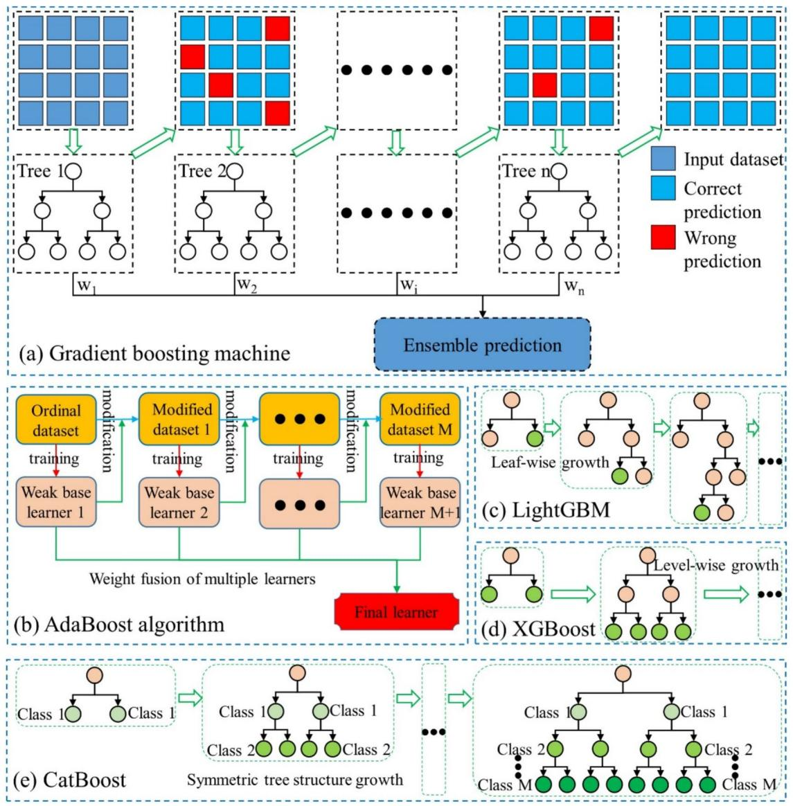  
Fig. 7 Sketch maps of a Gradient boosting, b AdaBoost, c LightGBM, d XGBoost and e CatBoost algorithms

$$
G _ { a i n } = 0 . 5 \left[ \frac { G _ { L } ^ { 2 } } { H _ { L } + \varepsilon } + \frac { G _ { L } ^ { 2 } } { H _ { R } + \varepsilon } - \frac { \left( G _ { L } ^ { 2 } + G _ { R } ^ { 2 } \right) ^ { 2 } } { H _ { L } + H _ { R } + \varepsilon } - \gamma \right]
$$

where $H _ { L } , H _ { R }$ and $\gamma$ are respectively the left tree classifcation, right tree classifcation and complexity cost by adding a node.

XGBoost algorithm has the advantages of fnding accurate classifcation conditions with high scalability and efciency, superior performance and robustness, but it is inevitably limited to large consumptions of computation and memory space, and is prone to overftting (Jiao et al. 2021; Zhang et al. 2022a, b).

CatBoost: CatBoost algorithm is also a variant of GBM for optimization process of dealing with categorical features and missing values, as shown in Fig. 7e (Hancock and Khoshgoftaar 2020). It contains the procedures of ordered target statistics, target-aware encoding, handing missing values, and parallel learning and distributed training, in which the optimization policy to avoid overftting can be expressed (Prokhorenkova et al. 2018)

$$
x _ { \sigma _ { p } , k } = \frac { \sum _ { j = 1 } ^ { p - 1 } \left[ x _ { \sigma _ { j } , k } = x _ { \sigma _ { p } , k } \right] \times Y _ { \sigma _ { j } } + \alpha P } { \sum _ { j = 1 } ^ { p - 1 } \left[ x _ { \sigma _ { j } , k } = x _ { \sigma _ { p } , k } \right] + \alpha }
$$

where $P$ and $\alpha > 0$ are respectively the priority dataset and its corresponding weight coefcients.

CatBoost algorithm has the advantages of high accuracy, easy utilization and versatility, and can deal with categorical features, but it is difcult to interpret as the number of trees is large and the computation cost is very high for large-scale datasets due to careful hyperparameter tunings for optimal performances (Ibrahim et al. 2020; Samat et al. 2021).

In summary, ensemble learning segmentation techniques of rock digital images have the advantages of higher prediction accuracy and robustness, lower overfitting risk and greater fexibility due to the combination of multiple machine learning models. Although it has higher computing complexity, lower interpretability and more tuning operations of hyperparameters, it still can provide efective tools for various rock digital image segmentation problems.

# 4 Deep Learning‑based segmentation techniques of multiscale rocks

DL-based segmentation algorithms have revolutionized the feld of image recognition and segmentation. Recently, numerous notable DL-based segmentation algorithms applied in rock structure analysis and 3D reconstruction of geometry models, which can be divided into the eight classifcations of algorithms containing convolution neural networks (CNNs), recurrent neural networks (RNNs) and generative adversarial networks (GANs) techniques, as shown in Fig. 8. Here, these typical DL-based algorithms extremely related to RDIS are studied, in which their models and applications are evaluated in details.

# 4.1 CNNs‑Based Segmentation Techniques

CNNs can automatically learn discriminative features from raw image data, eliminating the need for manual feature engineering, which can be divided into various classifcations of the U-network (U-Net), regions with CNN (R-CNN), visual geometry grope (VGG), DeepLab and full convolution network (FCN) (Du et al. 2020; Zhang et al. 2018; Zakaria and Hassim 2024; Wang et al. 2021a, b, c; Dolz et al. 2018). The model evaluations and characteristics of these algorithms are detailedly described as follows.

U-Net algorithms: U-Net segmentation algorithms are the methods with a “U-shape” network architecture of encoding and decoding layers, which consists of convolution, pooling, concatenation, and skip connection layers, as shown in Fig. 9a (Siddique et al. 2021). In the framework of the base U-Net algorithm, the corresponding energy function $E$ can be expressed as

$$
\left\{ \begin{array} { l l } { E = \sum w ( x ) \log \left[ p _ { k ( x ) } ( x ) \right] } \\ { p _ { k ( x ) } = \exp \left[ a _ { k } ( x ) \right] \Big / \sum _ { k ^ { \prime } = 1 } ^ { K } \exp \left[ a _ { k } ( x ) ^ { \prime } \right] } \end{array} \right.
$$

where $p _ { k }$ and $a _ { k }$ are respectively the pixel-wise SoftMax and activation functions in channel $k$ .

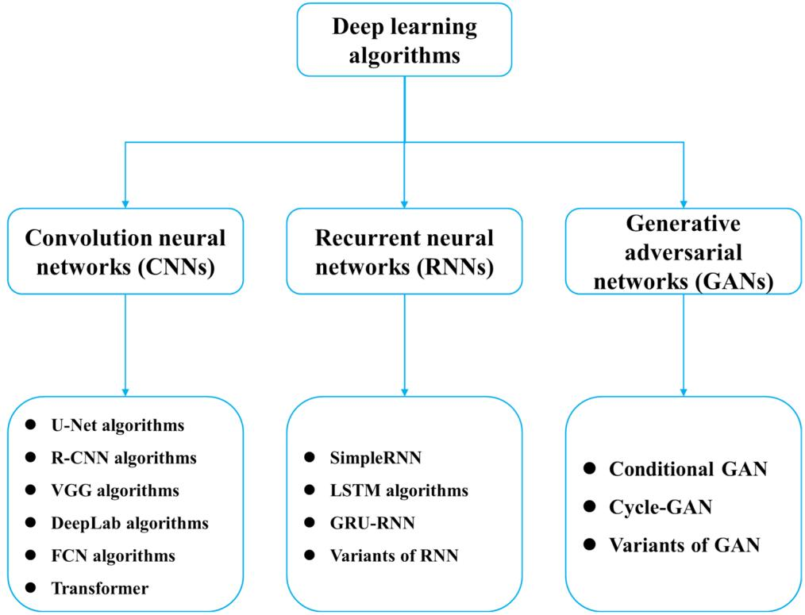  
Fig. 8 Various types of DL algorithm

Expecting for base U-Net algorithms, there exist many variants of U-Net algorithms to complete diferent segmentation tasks of multiscale rocks, containing the 3D U-Net, V-Net, nnU-Net, Nested U-Net, double U-Net, attention U-Net, R2U-Net and residual N-Uet (Siddique et al. 2021;

Zhao et al. 2023). In total, these U-Net algorithms have the advantages of efective utilizations of multiscale features to improve segmentation accuracy, easy to construct their architecture with simple networks, and strong abilities to deal with small sampling datasets, but they are limited to strong dependence on pre-labeled dataset for better segmentation performances (Du et al. 2020; Siddique et al. 2021).

R-CNN algorithms: R-CNN algorithms are the methods to enable generating large amounts of region proposals, then they are sent to pre-trained CNN (e.g. AlexNet) to extract features, and fnally implement the classifcation tasks using SVM (Zhang et al. 2018). The general R-CNN framework usually contains the region proposal selection network, pre-trained model and SVM classifer, as shown in Fig. 9b, in which the training loss $L _ { d e t e c t i o n }$ can be expressed as

$$
L _ { d e t e c t i o n } = L _ { o b j e c t } + L _ { r e g r e s s i o n } ; L _ { r e g r e s s i o n } ( x _ { i } , x _ { i } ^ { \prime } ) = R { \left( x _ { i } - x _ { i } ^ { \prime } \right) }
$$

where $L _ { o b j e c t }$ and $L _ { r e g r e s s i o n }$ are respectively the classifcation loss and regression loss.

There are some variants of R-CNN algorithm containing the fast R-CNN, faster R-CNN, mask R-CNN, hybrid task cascade, ms R-CNN, mask scoring R-CNN and boundary-aware instance segmentation algorithms (Rao et al. 2019). These algorithms have the highly improved accuracy of objective detections. Although there are some limitations of low training efciency and high computation complexity and cost, these algorithms still show great potentials for segmentation tasks of multiscale rocks (Yue et al. 2022).

VGG algorithms: VGG algorithms are classifcation algorithms of convolution operations with diferent layers, pooling layer and full connection layer (Fig. 9c), which are respectively expressed as (Zakaria and Hassim 2024)

$$
\zeta _ { c o n v o l u t i o n }  [ ( m \times n \times d ) + 1 ] \times k
$$

$$
\{ \begin{array} { l l } { \zeta _ { p o o l i n g } ^ { W } \big ( W _ { 2 } \big )  W 2 = ( W 1 - F ) / S + 1 } \\ { \zeta _ { p o o l i n g } ^ { H } \big ( H _ { 2 } \big )  H 2 = ( H 1 - F ) / S + 1 } \\ { \zeta _ { p o o l i n g } ^ { D } \big ( D _ { 2 } \big )  D 2 = D 1 } \end{array} 
$$

$$
\zeta _ { c o n n e c t i o n }  ( c \times p ) + c
$$

where 𝜁convolution, $\zeta _ { p o o l i n g }$ and $\zeta _ { c o n n e c t i o n }$ are respectively the convolution, pooling and full connection operators.

Excepting for base VGG algorithms, there are some variants of VGG segmentation techniques with diferent numbers of convolution layers, which are respectively named VGG11 with 11 convolution layers and its variant of LRN, VGG13 with 13 convolution layers, VGG16 with 16 convolution layers and its variant of VGG16-Conv1, VGG19 with 19 convolution layers, SegNet and Bayesian SegNet algorithms (Zakaria and Hassim 2024). These algorithms have the advantages of powerful feature ability, simply and easy training process, and excellent balance ability of accuracy and computation efciency. Although VGG algorithms are inevitably limited to the low computation ability of small objects, multiscale feature and end-to-end optimization, they still can provide excellent tools for DL-based image segmentation of rocks (Bai et al., 2019).

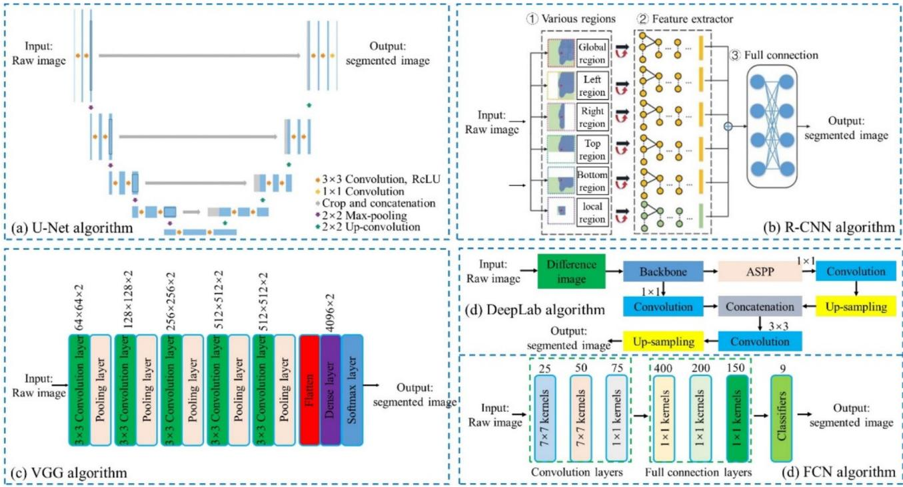  
Fig. 9 Sketch maps of a U-Net (Siddique et al. 2021), b R-CNN (Zhang et al. 2018), c VGG (Zakaria and Hassim 2024), d DeepLab (Wang et al. 2021a, b, c) and e FCN (Dolz et al. 2018) algorithms

DeepLab algorithms: DeepLab algorithms are a family of semantic segmentation methods using the atrous convolution and spatial pyramid pooing (ASPP) layers for capturing more detailed information and multiscale feature fusion (Fig. 9d), in which the expression of atrous convolution for den for extracting dense features under the one-dimensional case can be written as (Chen et al. 2017)

$$
y [ i ] = \sum _ { k = 1 } ^ { K } x [ i + r \times k ] w [ k ]
$$

where $x [ i ] , y [ i ] , w [ k ]$ and $r$ are respectively the input, output, flter and rate parameters.

Excepting for the base DeepLab algorithms, there are some variants of DeepLab algorithm including the DeepLab V1, DeepLab V2, DeepLab V3, DeepLab ${ \ o { 3 + } }$ and autoDeepLab algorithms (Liu et al. 2019; Wang et al. 2021a, b, c). Although DeepLab algorithms have extreme data dependence, and high computation complexity due to the low interpretability of working mechanism and large training difculties, these algorithms still can be widely applied for image segmentation in the computer vision feld benefting from their high robustness, efciency, accuracy and implementation procedures (Liu et al. 2019; Wang et al. 2021a, b, c).

FCN algorithms: FCN algorithms are methods similar to conventional CNNs, in which the full connection layers are applied rather than the convolution layer in conventional CNNs (Fig. 9e), in which the $m { - } t h$ output feature map from $k$ -th layer and the class probability score can be respectively expressed as (Dolz et al. 2018)

$$
\left\{ \begin{array} { l l } { { \displaystyle Y _ { k } ^ { m } = f \left( \sum _ { n = 1 } ^ { m _ { k - 1 } } W _ { i } ^ { m , n } \otimes X _ { k - 1 } ^ { n } + b _ { k } ^ { m } \right) } } \\ { { \displaystyle p _ { c } = \exp \big ( Y _ { L } ^ { c } \big ) \Big / \sum _ { c ^ { \prime } = 1 } ^ { C } \exp \big ( Y _ { L } ^ { c ^ { \prime } } \big ) , c \in \{ 1 , \cdots , C \} } } \end{array} \right.
$$

where $W _ { i } ^ { m , n }$ , $b _ { k } ^ { m }$ , $X$ and $Y$ are respectively the flter convolution with convolution layer of $\otimes$ , bias, input and output.

Excepting for the base FCN algorithm, there exist some notable variants of the FCN algorithm, which contains the encoder-decoder FCN, Atrous convolution FCN, pyramid pooling FCN, attention-based FCN, lightweight FCN, semi-supervised FCN, cascaded refnement FCN and instance-aware FCN algorithms (Sun et al., 2023). FCN algorithm has the advantages of end-to-end training with enough preserved spatial information, and efcient pixel-wise prediction ability with high adaptability for diferent segmentation tasks (Dolz et al. 2018). Although FCN algorithm is limited to coarse segmentation results of rocks with limited contextual information and hyperparameters sensitivity, these limitations can be efectively addressed by a suitable selection of the variants algorithms of FCN (Wu et al. 2021).

Transformer techniques: Transformer-based segmentation techniques can be

considered as another similar version of CNN method. It uses the global attention mechanism to conduct the image segmentation tasks by dividing the image into patch images, which can reserve the spatial information by replacing the CNN with transformer (Xie et al., 2021). Generally, the transformer-based segmentation techniques can be classifed as the vision transformer (ViT), swin transformer, maksformer and mask2former as well as coupling mask R-CNN-transformer model.

Although transformer-based segmentation techniques of rocks have the advantages of superior segmentation precision in mineral grain boundary detection, rock porosity and cracking trace extraction, it still has the limitations of data scarcity, labeling efort, and model generalizability for diferent rock types (Aleissaee et al., 2023).

In summary, CNNs-based segmentation techniques have the advantages of automatic learning of various features, superior precision of segmentation results, and high scalability with end-to-end training procedures, but these algorithms are inevitably limited to lower generalization ability and interpretability as well as high computation complexity since they depend extremely on lots of annotated data during the training process. Although these limitations restrict their application range on specifc requirements, CNN-based segmentation techniques can still provide excellent tools for the segmentation tasks of multiscale rocks..

# 4.2 RNNs‑Based Segmentation Techniques

RNNs-based segmentation techniques are a classifcation of methods to employ the internal state memory of RNNs to obtain the spatial–temporal information of input images characterized by rows or columns to conduct the implementation tasks, which can be simply divided into SimpleRNN, long short-term memory networks (LSTMs) and Gated Recurrent Unit-RNN (GRU-RNN) algorithms (Dhruv and Naskar 2020; Weerakody et al. 2021). Their model evaluations and characteristics of these algorithms are detailedly described as follows.

SimpleRNN algorithm: SimpleRNN algorithm is the base framework with the simplest recurrent neural network characterizing by single hidden state memory, in which the relevant spatial-temporal information is stored (Kawakami 2008), as shown in Fig. 10a. The updating of state memory with the activation function of tanh and mean square error (MSE) loss function in the training process can be written as

$$
\left\{ \begin{array} { l } { H _ { t } = f _ { t a n h } \big ( W _ { 1 } X _ { t } + W _ { R } H _ { t - 1 } \big ) } \\ { Y _ { T } = - W _ { o } H _ { t } + b } \\ { L o s s _ { M S E } = M S E \big ( Y _ { T } , l a b e l _ { t } \big ) } \end{array} \right.
$$

where $X _ { T } , ~ Y _ { T }$ and $f _ { t a n h }$ and $L o s s _ { M S E }$ are, respectively, the input, output, activation and loss functions.

SimpleRNN algorithm has the advantages of simple network architecture, which is easy to understand with high computing efciency and fewer requirements of parameters, but it is inevitably limited to unstable training due to the vanishing and exploding gradient sensitivity and long-term dependence of sequence dataset (Dhruv and Naskar 2020).

LSTM algorithms: LSTM algorithm is the a method to resolve the issue of base RNN methods by long-term dependence of sequence dataset, which consists of three specialized three gates of forget gate $( F _ { n } )$ , input gate $( I _ { n } )$ and output gate $( O _ { n } )$ with cell and hidden states (Hochreiter and Schmidhuber 1997), as shown in Fig. 10b, which are respectively expressed as

$$
\left\{ \begin{array} { l } { F _ { n } = \sigma \left\{ W _ { F } \left[ \begin{array} { l } { X _ { n } } \\ { H _ { n - 1 } } \end{array} \right] + b _ { F } \right\} } \\ { I _ { n } = \sigma \left\{ W _ { I } \left[ \begin{array} { l } { X _ { n } } \\ { H _ { n - 1 } } \end{array} \right] + b _ { I } \right\} } \\ { O _ { n } = \sigma \left\{ W _ { O } \left[ \begin{array} { l } { X _ { n } } \\ { H _ { n - 1 } } \end{array} \right] + b _ { O } \right\} } \\ { S _ { c e l l } ^ { n } = F _ { n } \otimes S _ { c e l l } ^ { n - 1 } + I _ { n } \oplus \iota a n h \left\{ W _ { c e l l } \left[ \begin{array} { l } { X _ { n } } \\ { H _ { n - 1 } } \end{array} \right] + b _ { c e l l } \right\} } \\ { S _ { n i d e n } ^ { n } = O _ { n } \otimes t a n h \left( S _ { c e l l } ^ { n } \right) } \end{array} \right.
$$

where $S _ { c e l l } ^ { n }$ l and Snhid $S _ { h i d d e n } ^ { n }$ are respectively the cell and hidden states.

Excepting for the base LSTM algorithms, there exist some variants of LSTM algorithms, which contains the bidirectional LSTM (Bi-LSTM), convolutional LSTM (ConvLSTM), hierarchical LSTM, attention-based LSTM and neural turning machine (NTM) (Graves 2012; Yu et al. 2019). LSTM algorithm has the abilities to overcome the varnishing gradient issue by accurately obtaining long-term dependencies from sequence dataset with higher robustness and is more flexible for different sequence-to-sequence tasks. Although the LSTM algorithm and its variants have the limitations of higher computation complexity and memory requirements, overftting and low interpretability for the decision-making process, they still can be a go-to choice for rock image segmentation tasks (Graves 2012; Yu et al. 2019).

GRU-RNN algorithm: GRU-RNN is the improved version of simpleRNN, which is also similar to LSTM algorithm. It consists of two gates of reset gate $( G _ { r e s e t } )$ and update gate $( G _ { u p d a t e } )$ , and two states of candidate hidden state $( C H _ { t } )$ and hidden state $( H _ { t } )$ , as shown in Fig. $1 0 \mathrm { c }$ , which is respectively written as (Weerakody et al. 2021)

$$
\left\{ \begin{array} { l } { G _ { r e s e t } = \sigma \big \{ W _ { r e s e t } \cdot \big [ H _ { t - 1 } , X _ { t } \big ] \big \} } \\ { G _ { u p d a t e } = \sigma \big \{ W _ { u p d a t e } \cdot \big [ H _ { t - 1 } , X _ { t } \big ] \big \} } \\ { C H _ { t } = t a n h \big \{ W \cdot \big [ G _ { u p d a t e } \times H _ { t - 1 } , X _ { t } \big ] \big \} } \\ { H _ { t } = \big ( 1 - G _ { r e s e t } \big ) \times H _ { t - 1 } + G _ { r e s e t } \times C H _ { t } } \end{array} \right.
$$

where $X _ { t }$ denotes the input.

Exactly, to deal with diferent segmentation tasks of various materials, some variants of GRU-RNN algorithm have been successfully developed including the bidirectional GRU (Bi-GRU), attention-based GRU, residual GRU, multiplicative integration GRU (MI-GRU), convolutional GRU (ConvGRU) and coupled input-forget gate GRU (CIFGGRU) (Nosouhian et  al. 2021). These algorithms have the advantages of being less prone to varnishing gradient problems with simpler architecture and high computation efciency, showing better performances to model long-term dependencies, but they also have the limitations of sensitivity for hyperparameters tuning and initialization and low interpretability (Shiri et al. 2023).

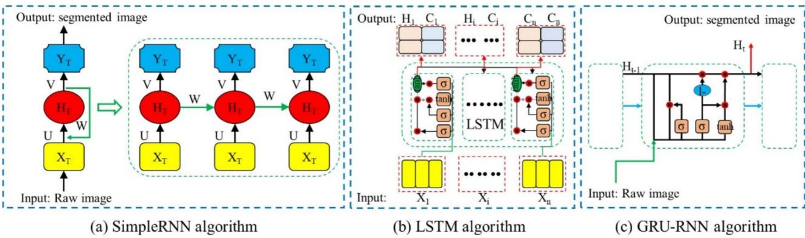  
Fig. 10 Sketch maps of a SimpleRNN, b LSTM and c GRU-RNN algorithms (Kawakami 2008; Hochreiter and Schmidhuber 1997; Cho et al. 2014)

In summary, RNNs-based segmentation techniques have the advantage of improving segmentations accuracy due to spatial–temporal dependencies and internal state memory, and general adaptivity of various image size without fxed input resolution. Although RNNs-based segmentation techniques also have the limitations of being prone to training convergence difculties due to gradient vanishing, high computation complexity with lower parallelization computation functions, and overftting for small datasets, they can also provide efective tools for segmentation tasks of multiscale rocks.

# 4.3 GANs‑based segmentation techniques

GANs-based segmentation techniques are a family of methods using the adversarial training process of generator and discriminator networks to conduct the segmentation tasks from the segmentation mask to input images, which can be simply divided into conditional GANs and cycle-GANs algorithms (Iqbal et al. 2022).Their model evaluations and characteristics of these algorithms are detailedly described as follows.

Conditional GAN algorithm: Conditional GANs is the method to take conditional information, such as digital labels, feature maps or others, as the inputs to obtain the segmentation results, in which the training process (Fig. 11a) with the price function can be expressed as (Jin et al. 2023)

$$
\operatorname* { m i n } _ { G } \operatorname* { m a x } _ { D } V ( D , G ) = E _ { x \sim p d a t a ( x ) } \left[ \log D ( x | y ) \right] + E _ { z \sim p z ( z ) } \left\{ \log \left[ 1 - D ( z | y ) \right] \right\}
$$

where $G , D , x , z .$ , and $y$ are respectively the generator, discriminator, real sample point, generated sample point and conditions.

Cycle-GAN algorithm: Cycle-GAN algorithm is the method to complete the image translation from one domain to another domain by using two pairs of generators and discriminators with the cycle-consistency loss, as shown in Fig. 11b, which can be expressed as (Cho et al. 2020)

$$
\begin{array} { r l } & { L _ { c y c l e } \big ( G _ { N } , G _ { D } \big ) = E _ { x \sim p d a t a ( x ) } \Big \{ \Big \| G _ { N } \big [ G _ { D } ( x ) \big ] - x \Big \| _ { 1 } \Big \} } \\ & { ~ + E _ { y \sim p d a t a ( y ) } \Big \{ \Big \| G _ { D } \big [ G _ { N } ( y ) \big ] - y \Big \| _ { 1 } \Big \} } \end{array}
$$

where $L _ { c y c l e }$ and $G$ are respectively the cycle consistency loss and generator.

Excepting for the common conditional GANs and cycleGANs algorithms, there are many variants of GANs. Their corresponding architectures and characteristics are listed in Table 1.

In summary, GANs-based segmentation techniques for roc digital images have the advantages of easy training for limited large-scale annotated dataset, synthesizing realistic segmentation results to enhance data diversity, and improving segmentation results by adversarial training to learn more powerful characteristics. However, GANs-based algorithms are inevitably limited to complicated training process to carefully balance the image generator and discriminator without an interpretable mechanism for the training process, in which large amounts of hyperparameter fne-tunings should be conducted to obtain good convergence (Durgadevi 2021).

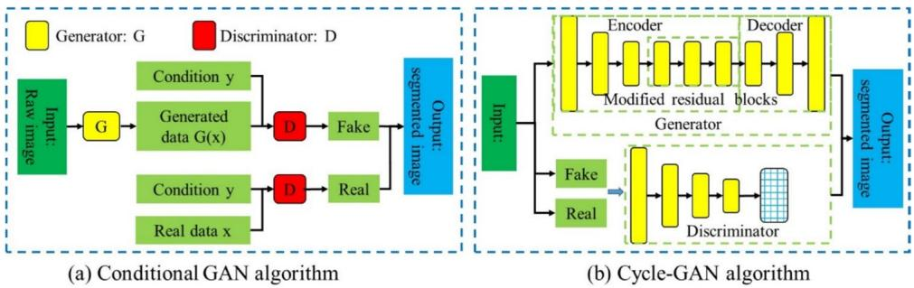  
Fig. 11 Sketch maps of a conditional GAN and b cycle-GAN algorithms (Jin et al. 2023; Cho et al. 2020)

# 5 Hybrid ML‑DL Segmentation Techniques

Hybrid approaches combine ML and DL techniques to leverage the strengths of both paradigms. These approaches often involve using DL models for feature extraction and traditional ML algorithms for classifcation or regression tasks. Some notable hybrid approaches in rock segmentation include attention mechanism-based techniques, transfer learning-based techniques, domain adaptation-based techniques and self-supervised learning-based techniques (Ali et al. 2022), as shown in Fig. 12. Here, these typical hybrid ML-DL algorithms extremely related to RDIS are studied, in which their models are evaluated.

Table 1 The architectures and characteristics of the variants of GANs-based segmentation algorithms   

<table><tr><td>Categories Algorithms</td><td>Architectures</td><td>Characteristics</td><td>References</td></tr><tr><td>Conditional patch GANs</td><td>Adding the patches into discriminator rather than whole image types</td><td>Better performance of local segmentation results and high segmentation abilities</td><td>Kang and Feng 2022</td></tr><tr><td>Adversarial-SegNets</td><td>Coupling of discriminator and segmentation network</td><td>Matching the segmentation results and real- istic labels</td><td>Huang et al., 2018</td></tr><tr><td>Attention-guided GANs</td><td>Adding attention mechanism into the genera- tor and discriminator</td><td>High segmentation performance for small target or complex cases</td><td>Lu et al. 2022</td></tr><tr><td></td><td>Dual-discriminator GANs Respective discriminator network for judge- ments of authenticity and semantic consist-</td><td>Generating more semantically consistent segmentation results</td><td>Ma et al. 2020</td></tr><tr><td>Multi-scale GANs</td><td>ency Adding multiscale features extraction modu- lus into generator and discriminator</td><td>Obtaining multiscale segmentation informa- Xue et al. 2018 tion with high performance</td><td></td></tr><tr><td>Stackeberg GANs</td><td>Using the Stackeberg policy in generator and discriminator</td><td>Excellent balance the training of generator and discriminator to improve the conver- gences</td><td>Creswell et al. 2018</td></tr><tr><td>Edge-enhanced GANs</td><td>Adding edge enhancing modulus into GAN</td><td>Improving the accuracy and articulation of segmentation results</td><td>Zhang et al. 2023a, b</td></tr></table>

# 5.1 Attention Mechanism‑Based Segmentation Techniques

Attention mechanism-based segmentation techniques are a classifcation of methods to complete the segmentation tasks by improving the characterizations of crucial regions, limiting interference of insignifcant regions and multiscale feature fusion by employing diverse attention mechanisms (Guo et al. 2022). Table 2 shows the typical classes of attention mechanism-based segmentation techniques with the corresponding characteristics and representative algorithms.

Generally, attention mechanism-based segmentation methods have the advantages of high segmentation accuracy with improving robustness and interpretability, but there also exist some limitations of high computation cost, instable training process and limited generalization capability, which are mainly caused by the extra operations from diverse attention mechanisms (Guo et al. 2022). Therefore, attention mechanism-based segmentation methods are a signifcant studying point in image segmentation felds, which can provide excellent tools for RDIS of multiscale rocks.

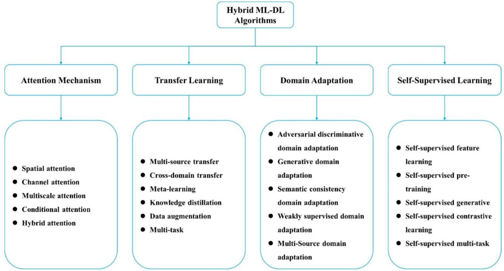  
Fig. 12 Various hybrid ML-DL algorithms

# 5.2 Transfer Learning‑Based Segmentation Techniques

Transfer learning-based segmentation techniques are a classifcation of methods to conduct the image segmentation tasks based on the transferred knowledge or characteristics from the large-scale pre-training models to enhance the segmentation model performance of small-scale dataset (Weiss et al. 2016). Based on the diferent characteristics of segmentation models, various transfer learning-based segmentation techniques have been shown in Table 3, in which their characteristics and representative algorithms are described.

Overall, transfer learning-based segmentation methods have the advantage of accelerating convergence abilities by improving sampling rate, strengthening segmentation and generalization capabilities, and enhancing robustness (Kora et al. 2022). Although transfer learning-based segmentation methods have also the requirements of carefully selecting suitable pre-training models to balance the segmentation performances and training cost (Kora et al. 2022), these segmentation methods can still provide excellent tools for RDIS of multiscale rocks with a suitable selection of diverse transfer policies for optimal segmentation performance.

# 5.3 Domain Adaptation‑Based Segmentation Techniques

Domain adaptation-based segmentation techniques are a classifcation of methods with similar characteristics of transfer learning. It can implement high-performance segmentation tasks on the objective regions with diferent distributions through the transferred pre-training model from the original region (Toldo et al. 2020). Based on the diferent characteristics of segmentation models, various domain adaptation-based segmentation techniques have been shown in Table 4, in which their characteristics and representative algorithms are described.

Generally, domain adaptation-based segmentation methods have the advantages of decreasing the marking cost with efective utilizations of source domain dataset, improving the model robustness for dataset with diferent distributions and segmentation performances of object domain (Guan and Liu 2021), but these algorithms have the limitations of complex training process with complex alignment and generative polices, and require sometimes access to source domain data for adaptation of target domain (Guan and Liu 2021). Therefore, it is still a hot point of rock segmentation by narrowing the data distribution diference and improving the generalization capability of segmentation models.

# 5.4 Self‑Supervised Learning‑Based Segmentation Techniques

Self-supervised learning-based segmentation techniques are a classifcation of methods to learn efective feature representation by considering the internal structure and characteristics of data as the supervised information without requiring artifcial labelled data (Toldo et al. 2020). Based on diferent characteristics of segmentation models, various self-supervised learning-based segmentation techniques have been shown in Table 5, in which their characteristics and representative algorithms are described.

Table 2 Typical classes of attention mechanism-based segmentation techniques   

<table><tr><td>Categories Class</td><td>Characteristics</td><td>Representative algorithms</td><td>References</td></tr><tr><td>Spatial attention segmentation</td><td>Improved perception of important regions by recognizing crucial spatial area information</td><td>Attention U-Net; Attention gate net- works</td><td>Wang et al. 2021a, b, c</td></tr><tr><td>Channel attention segmentation</td><td>the eff ects of diff erent channels</td><td>Adaptively change the weights based on Channel attention U-Net; CSAU-Net</td><td>Zhao et al. 2020</td></tr><tr><td>Multiscale attention segmentation</td><td>Improved segmentation ability with feature fusion from different scales</td><td>Asymmetric attention U-Net; Gated attention U-Net</td><td>Chen et al. 2023</td></tr><tr><td>Interaction attention segmentation</td><td>lishing the interactions of different feature maps</td><td>Improved discriminable ability by estab- Dual-attention network; PFNet</td><td>Wang et al. 2021a, b, c</td></tr><tr><td>Conditional attention segmentation Adaptively adjust the attention mecha-</td><td>nism to improve its flexibility and generalization</td><td>Conditional random field network; Con- Zhou et al. 2019 ditional batch normalization</td><td></td></tr><tr><td>Hybrid attention segmentation</td><td>Joint optimization of various attention mechanism such as spatial-, channel-, and multiscale attentions</td><td>AA-Net; DANet; OCNet</td><td>Zhu et al. 2019</td></tr></table>

Table 3 typical classes of transfer learning-based segmentation techniques.   

<table><tr><td>Categories Class</td><td>Characteristics</td><td>Representative algorithms</td><td>References</td></tr><tr><td>Multi-source transfer segmentation</td><td>Transfer learning pre-training model with multi-source datasets</td><td>Adaptation-based shallow fusion; Pro- gressive transfer learning</td><td>Zhang et al. 2023a, b</td></tr><tr><td>Cross-domain transfer segmentation</td><td>Segmentation tasks from the fi eld to another f eld</td><td>CycleGAN-based domain adaptation; Cross-domain alignment</td><td>Zhang et al. 2022a, b</td></tr><tr><td>Meta-learning segmentation</td><td>by meta-learning</td><td>Fast adaptivity novel segmentation tasks MAML; Gradient-based meta-learning</td><td>Khadka et al. 2022</td></tr><tr><td>Knowledge distillation segmentation</td><td>1 Using the knowledge of large-scale model to train smaller segmentation model</td><td>Distilling knowledge from large-scale networks; Collaborative learning</td><td>Osman et al. 2023</td></tr><tr><td>Data augmentation segmentation</td><td>segmentation model from newly gener- Adversarial data augmentation ated training samples</td><td>Improving the generalization ability of CycleGAN for data augmentation;</td><td>Chen et al. 2022</td></tr><tr><td>Multi-task segmentation</td><td>the other tasks</td><td>Joint learning of segmentation task with Segmentation and detection; Segmenta- Park et al. 2020 tion and reconstruction</td><td></td></tr></table>

Table 4 typical classes of domain adaptation-based segmentation techniques.   

<table><tr><td>Categories Class</td><td>Characteristics</td><td>Representative algorithms</td><td>References</td></tr><tr><td>Adversarial discriminative domain adaptation</td><td>Segment features under unchanged Adversarial entropy minimiza- learning domain via adversarial training process</td><td>tion; Cross-region collaborative domain adaptation</td><td>Vesal et al. 2021</td></tr><tr><td>Generative domain adaptation</td><td>by adversarial network, reducing the difference between source and objective domains</td><td>Generating median region samples StarGAN for domain adaptation; Sim GAN for domain adaptation</td><td>Tasar et al. 2020</td></tr><tr><td>Semantic consistency domain adaptation</td><td>Aligning the characteristic distri- butions of source and objective regions under semantic level</td><td>Fourier domain adaptation; Class-wise adversarial network</td><td>Wang et al. 2023a, 2023b, 2023d,</td></tr><tr><td>Weakly supervised domain adapta- I tion</td><td>Employing labels to conduct the domain adaptation process</td><td>Scribble-supervised learning; Curriculum domain adaptation</td><td>Wang et al. 2023a, 2023b, 2023d</td></tr><tr><td>Multi-Source domain adaptation</td><td>Simultaneously conduct the seg- mentation with multiple source and target domains</td><td>Progressive transfer learning; Adaptation-based shallow fusion</td><td>Gu et al. 2019</td></tr></table>

Overall, self-supervised learning-based segmentation methods have the advantages of improving the segmentation performances of small-scale data with decreasing demands of labelled data and improving the transfer capability and accuracy of segmentation model with high robustness and generalization (Shurrab and Duwairi 2022). However, the task designs of self-supervised learning-based segmentation would cause large diferences under diferent conditions, and the computation costs are large for self-supervised training and fne-tuning processes with low interpretability (Shurrab and Duwairi 2022). Although self-supervised learning-based segmentation methods face some limitations, they can still provide efective tools to rock digital image segmentation tasks, especially for reducing the dependence on data and improving the generalization.

# 6 Applications, Challenges and Future Directions of DL and ML‑Based Segmentation Techniques

# 6.1 Evaluation Indexes of ML and DL Models

The performance evaluations of various ML, DL and hybrid ML-DL segmentation algorithms are crucial to illustrate their availability and accuracy. The corresponding evaluation indexes of ML, DL and hybrid ML-DL can be divided into three classifcations including the evaluation indexes of model, segmentation performance and computation efciency, and their defnitions with interpretations are shown in Table 6.

Table 5 Typical classes of self-supervised learning-based segmentation techniques   

<table><tr><td>Categories Class</td><td>Characteristics</td><td>Representative algorithms</td><td>References</td></tr><tr><td>Self-supervised feature learning seg- mentation</td><td>Learning effective features from unla- beled data</td><td>Pixel contrastive learning; MoCo for medical image segmentation</td><td>Shi et al. 2022</td></tr><tr><td>Self-supervised pre-training segmenta- tion</td><td>Fine-tuning segmentation model for special task</td><td>BYOL for medical image segmenta- tion; SimCLR for biomedical image segmentation</td><td>Wu et al. 2022</td></tr><tr><td>Self-supervised generative segmenta- tion</td><td>Learning the segmentation feature rep- resentations by the generative tasks</td><td>Jigsaw puzzle solving; Inpainting for segmentation</td><td>Markaki and Panagiotakis., 2023</td></tr><tr><td>Self-supervised contrastive learning</td><td>Contrastive learning manner with robustness</td><td>nnU-Net with self-supervised pre- training; TransUNet with contrastive learning</td><td>Isensee et al. 2021</td></tr><tr><td>Self-supervised multi-task</td><td>Joint learning of segmentation tasks with the other self-supervised tasks</td><td>Segmentation and reconstruction; Multi-task self-supervision</td><td>Liu et al. 2021</td></tr></table>

In addition, although these evaluation indexes of model, segmentation performance and computation efciency can efectively evaluate the performance, availability and accuracy of various ML, DL and hybrid ML-DL segmentation algorithms, it is still essential to defne more evaluation indexes, such as the volume ratio and grain analysis index, to accurately evaluate the segmentation performance in RDIS feld considering the complex and heterogeneous structures of multiscale rocks.

In fact, DL-based segmentation techniques can be considered as the sub-classifcation of ML-based segmentation techniques, which relies mainly on the convolution neural network for feature extraction during rock image segmentations. ML-based segmentation techniques, such as random forests, support vector machines, and $\mathbf { k }$ -means clustering, depend heavily on the artifcially selected features in the specifed domain during preprocessing procedures. Although ML-based segmentation techniques perform well on relatively simple textures and limited datasets, the corresponding accuracy of segmentation results usually decreases with increasing structural heterogeneity of rocks. On the contrary, DL-based segmentation techniques, particularly CNNs and U-Net methods, demonstrate superior abilities of capturing complex, multiscale features directly from rock images. These methods have excellent generalization and spatial coherence, especially when it is trained by large and annotated datasets. However, they require a large amount of computational resources and an extensive labeled dataset, and the corresponding accuracy would decline in data-scarce environments.

In total, ML-based segmentation techniques provide lightweight, interpretable solutions for simpler tasks, while DL-based segmentation techniques ofer higher accuracy and robustness for complex segmentation tasks. In addition, the hybrid ML-DL segmentation techniques can leverage the strengths, which could provide a promising direction for future research in digital rock image analysis.

# 6.2 Applications of ML and DL Segmentation Techniques in Digital Rock Analysis

ML and DL segmentation techniques play signifcant roles in various rock engineering felds such as geothermal and oil–gas exploitations, underground space and tunnel excavations, $\mathrm { C O } _ { 2 }$ geological storage and nuclear wastes deep bury, in which their detail applications can be simply classifed into petro-physical parameter evaluations, realistic 3D modeling, and cracking behaviors as well as failure mechanism analyses of multiscale rocks.

# 6.2.1 Petro‑Physical Parameter Evaluations

Multiscale petro-physical parameter evaluations are of paramount importance for the design, stability and safety problems of various rock engineering projects, in which the RDIS of solid matrix of various minerals, interfacial transition zones of clay and cements, and void spaces of various pores and cracks as well as diferent fuids in void spaces are crucial to determine the thermal–hydraulicmechanical properties of rocks at diferent scales (Saxena and Mavko., 2016; Zhao et al. 2024a, b). The ML, DL and hybrid ML-DL segmentation models to conduct the petrophysical parameter evaluations can be classifed into (1) multiscale structure parameters characterizing geometric heterogeneous features, which can be extensively applied to construct various 3D models of diverse rocks at different scales (Ma et  al. 2022; Li et  al., 2024); and (2) multiscale thermal, hydraulic, chemical and mechanical properties of rocks (Saxena and Mavko., 2016; Zhao and Zhou 2021; Saxena et al. 2017), as shown in Fig. 13. For instances, Zhao et al., 193 studied the structure characterizations of various phases with the corresponding ratios and size distributions, and analyzed the thermal–hydraulic properties based on various segmented phases of rocks. Andrä et al., (2013) and Saxena et al., (2017) computed the permeability, electrical resistivity and elastic modulus using the segmentation results of various rocks. Generally, the previous works have validated that the ML, DL and hybrid ML-DL segmentation methods have the great potential to determine the structure parameters and thermal, hydraulic, chemical and mechanical properties of rocks, which enables the coupling methods of ML-DL and physics-based simulations or inverse modeling for petro-physical parameter evaluations. However, their applications to deeply characterize the material parameter distributions of multiscale heterogeneous rocks are still challengeable (Yang et al. 2024; Lin et al. 2024), which can focus on the matching methods between the material parameters and geometry structures under diferent scales by ML, DL and hybrid ML-DL segmentation models.

Table 6 Evaluation indexes of ML, DL and hybrid ML-DL models   

<table><tr><td>Categories Classifications</td><td>Evaluation index</td><td>Expression</td><td>References</td></tr><tr><td>Model evaluation indexes</td><td>Pixel accuracy</td><td>(Tp + TN)/ (Tp + FP + TN + FN) Tp-true positive pixel number; TN-true negative pixel number; F-false positive pixel number; Ffalse nega-</td><td>Schwenker2013; Powers 2011; Everingham et al. 2010</td></tr><tr><td></td><td>Mean accuracy</td><td>tive pixel number (TP1/ 1 + TP2/ 2+ . TPn/ Pn)/ n TP-the i-th true positive pixel, Pi the i-th total number of</td><td></td></tr><tr><td></td><td>Intersection over Union</td><td>pixels, n-class number TP/ (TP + FP + FN)</td><td></td></tr><tr><td></td><td>Mean intersection over union</td><td>(I0U1 + I0U2 + … + IoUn)/ n</td><td></td></tr><tr><td></td><td>F1-score</td><td>IoU-the i-th IoU value (precision+recall)</td><td></td></tr><tr><td></td><td>Mean absolute error</td><td>precision = TP/ (TP + FP) recall = TP/ (TP + FN)</td><td></td></tr><tr><td></td><td></td><td>∑ 1|pi−- |/</td><td></td></tr><tr><td></td><td>Mean squared error</td><td>∑i−1(i− i))∞</td><td></td></tr><tr><td>Segmentation performance Boundary accuracy</td><td>Segmentation accuracy</td><td>1 − (|GT − P red|/ |GT|) Greal segmentation result; Pred-predicted segmentation result</td><td>Everingham et al. 2010;</td></tr><tr><td>evaluation indexes</td><td></td><td>1 − [∑d(Pbou − Gbou)/ Nbou] d(Pbou Gbou)-distance; Nbou-the number of boundary point</td><td>Zhao et al. 2017; Hu et al. 2012</td></tr><tr><td></td><td>Shape similarity</td><td>1 − (Apred − Agi|/ Ag)) Aprea-area of predicted segmentation domain; Ag-area of</td><td>Wang et al. 2004</td></tr><tr><td></td><td>Region coverage</td><td>realistic segmentation domain (Apred ∩ Agt)/ A_gt</td><td></td></tr><tr><td></td><td>Smoothness</td><td>1 − (|∇II/N) VI-image gradient; N-the number of boundary pixel</td><td></td></tr><tr><td></td><td>Structural similarity</td><td>(2+c1)(2σx+c2) (++c1)(σ2+σ2+c2)</td><td></td></tr><tr><td></td><td></td><td>-mean value; σ-standard deviation; c1,c2-constants</td><td></td></tr><tr><td>Computation efficiency</td><td>Dice similarity coefficient Constant time complexity</td><td>2 × A∩ B|/ (|A| + |B|)</td><td>Cormen et al. 2009</td></tr><tr><td>evaluation</td><td></td><td>T(n)= 0(1)</td><td></td></tr><tr><td>indexes</td><td>Linear time complexity</td><td>T(n)= 0(n)</td><td></td></tr><tr><td></td><td>Logarithmic time complexity</td><td>y T(n)= O(10gn)</td><td></td></tr><tr><td></td><td>Quadratic time complexity</td><td>T(n)= 0(n2)</td><td></td></tr><tr><td></td><td>Exponential time complexity</td><td>T(n) = O(2n)</td><td></td></tr><tr><td></td><td></td><td></td><td></td></tr><tr><td></td><td>Constant space complexity</td><td>S(n)= 0(1)</td><td></td></tr><tr><td></td><td>Linear space complexity</td><td>T(n)= 0(n)</td><td></td></tr><tr><td></td><td>Quadratic space complexity</td><td>S(n) = 0(n2)</td><td></td></tr></table>

# 6.2.2 Realistic 3D Modeling

3D modeling of realistic various structure of rocks plays a signifcant role to construct 3D models with realistic heterogeneous structures under diferent scales for numerical simulations and visualization analyses (Zhao and Zhou 2019). The ML, DL and hybrid ML-DL segmentation methods can be combined with high-resolution 3D reconstruction techniques to complete the multiscale 3D modeling tasks by creating various comprehensive and heterogeneous digital models of rocks under diferent scales, as shown in

Fig. 14. Realistic 3D modeling, by integrating ML and DL segmentation and 3D reconstruction techniques, can provide various 3D models of multiscale rocks, such as the 3D connective pore structure models, heterogeneous grain models and various types of crack models (Fig. 14). For examples, Zhao et al., (2021) proposed a GAN (generative adversarial network) method, with the generators and discriminators characterizing by 3D convolutions, to construct 3D digital rock models, which has equivalent porosity distributions of original rocks. Wang et al. (2023a, 2023b, 2023d) developed a DL-enhanced 3D reconstruction approach to construct 3D models of 2D random rock particles. Pan et al, (2024) proposed a multi-view stereo (MVS)-based transfer learning 3D reconstruction method to construct the 3D fracture models of rocks. These previous works have suggested that the ML, DL and hybrid ML-DL segmentation-based 3D realistic modeling techniques have powerful capability to construct various realistic 3D models of rocks from pore-scale to coarse-scale, which can be combined with multiphysics simulations, such as the geomechanics, thermal responses, fuid fow behaviors and fracturing process, to study the various responses of rocks under diferent conditions (Zhao et al. 2021; Guo et al. 2024). Although the ML and DL-based realistic 3D modeling with multiphysics simulations enables numerous applications for rock properties and responses predictions in various rock engineering felds such as deep resources and underground space explorations, they are still some limitations of the computation complexity, convergences and large-scale simulation difculties due to complicated heterogeneous structures of rocks under diferent scales.

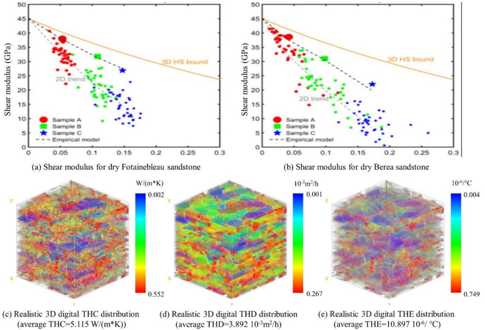  
Fig. 13 Examples of petro-physical parameter evaluations (Saxena and Mavko., 2016; Zhao and Zhou 2021)

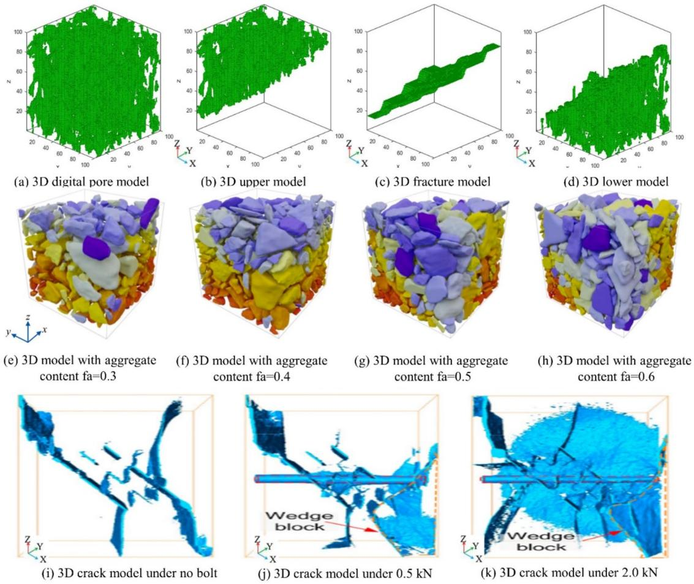  
Fig. 14. 3D modes of various structures of rocks under diferent scales (Zhao and Zhou 2023a, b; Huang et al. 2023; Yang et al. 2020a, b)

# 6.2.3 Cracking Behaviors and Failure Mechanism Analyses

The ML, DL and hybrid ML-DL algorithms can efectively segment the cracks and pores in rocks under diferent scales, which can be directly applied to elucidate cracking behaviors and failure mechanisms of multiscale rocks under various loading conditions (Yang et al. 2020a, b; Zhao et al. 2022a, 2022b; Fu et al. 2024; Haeri et al. 2025). They can also provide direct intuitive visualization 3D models of cracks and pores under diferent scales, which are helpful to analyze the corresponding progressive failure process and failure modes, as shown in Fig. 15, due to the great abilities of fast and accurate recognition and segmentation of various cracks under diferent scales. For instances, Zhao and Lu (2023) studied the cracking behaviors and failure process of coal reservoirs subjected to $\mathrm { C O } _ { 2 }$ desorption using the deep learning segmentation method. Byun et al., (2021) proposed a modifed U-Net deep learning method to segment rock fractures and study the crack types. Park et al., (2021) developed a nested encoder-decoder U-Net model to segment various cracks and study the injection rate and viscosity efects on the hydraulic fracturing process of granite. Generally, these previous works have evidenced that ML, DL and hybrid ML-DL segmentation methods can provide promising tools to analyze cracking behaviors and failure mechanism of rocks without artifcial interferences. However, the current ML, DL and hybrid ML-DL algorithms have some limitations of inaccurate complex fracture network, strong demands of large training dataset and low generalization (Li et al. 2023) due to the rock diversity and complex heterogamous structures of rocks under diferent scales, and more efective segmentation models with novel ML and DL techniques such as transfer learning and domain adaptation should be developed to deeply analyze the multiscale cracking behaviors and failure process of rocks (Shehata and Elhosseini 2024).

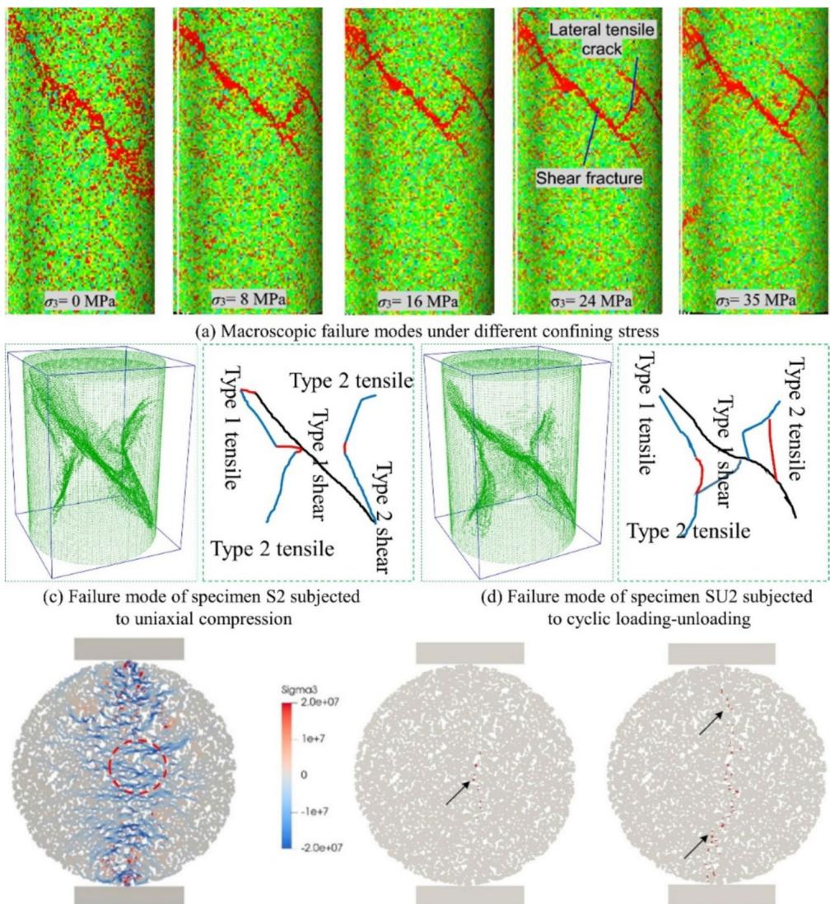  
Fig. 15 Examples of cracking behaviors and failure process of rocks (Yang et al. 2020a, b; Zhao et al. 2022a, 2022b; Chen et al. 2020)   
(e) Stress and damage maps of microscopic failure process under Brazilian test

# 6.2.4 Transport and Fluid Flow Analysis

The integration of ML and ML algorithms in rock segmentation makes it possible for researchers to fast and accurately analyze pore-scale fuid transport and rock permeability. By accurately characterizing pore spaces and solid matrices in CT or thin-section images, ML/DL models enable quantitative reconstruction of digital rock models. These models are crucial inputs for direct predictions and simulations of multiphase fuid fow behaviors and hydraulic properties such as rock permeability, capillary pressure, and relative permeability (Tembely et al. 2021; Zhang et al. 2024), as shown in Fig. 15. Advanced segmentation models like 3D U-Net, SegNet, ResNet-based encoders, and hybrid Transformer-CNN can enhance segmentation precision, especially for complex rocks like carbonates, shales, or heterogeneous sandstones. For instances, Tembely et al., (2021) proposed a hybrid ML-DL method to predict the permeability of complex carbonate rocks with the help of X-ray CT imaging. Fu et al., (2023) developed a data-driven framework to study the pore-scale fow behaviors of porous rocks. Jiang et al., (2023) proposed a 3D-CNN model to predict the upscaling permeability of rocks with the condition of Darcy’s law. Although these previous works have validated that the ML and DL-based segmentation techniques provide superior methods to study the fow behaviors and hydraulic properties, there are still some key challenges such as label scarcity and uncertainty quantifcation. The future dictions should focus on multi-modal fusion analysis (e.g., $\mathrm { S E M + }$ microCT) to further improve fow property estimation from digital rocks (Xie et al. 2023) (Fig. 16).

# 6.3 Challenges of ML and DL Segmentation Techniques

Currently, although various ML, DL and their hybrid segmentation techniques have been successfully developed and applied in numerous felds such as medical engineering, oil–gas reservoir engineering and tunnel and underground space engineering, there are still many limitations or challenges for ML and DL segmentation techniques of rock digital images, which can be simply concluded as follows.

Data limitations: In various frameworks of ML and DL segmentation models, a large amount of rock digital image dataset, with high quality and data diverse for multiscale and diferent types of rocks, are the foundation of various ML and DL algorithms, which would directly afect the accuracy and robustness of ML and DL models, since multiscale rocks contain various structures information such as the mineral information at grain scale and. Thus, taking reliable and enough data as ground truth annotations plays a signifcant roles in ML and DL models.

Challenges for generalization and performance: Any ML and DL model is usually trained from reliable and enough rock dataset, which is limited to the utilization of training models for the current dataset, and the welltrained model with a small amount of input dataset is difcult to apply for a large amount of dataset or the other types of dataset due to various internal structures of diverse rocks. Meanwhile, insufcient or imbalanced dataset during the training process may cause poor generalization and performance of segmentation models. Thus, it should be traded of between the generalization and segmentation accuracy of ML and DL models.

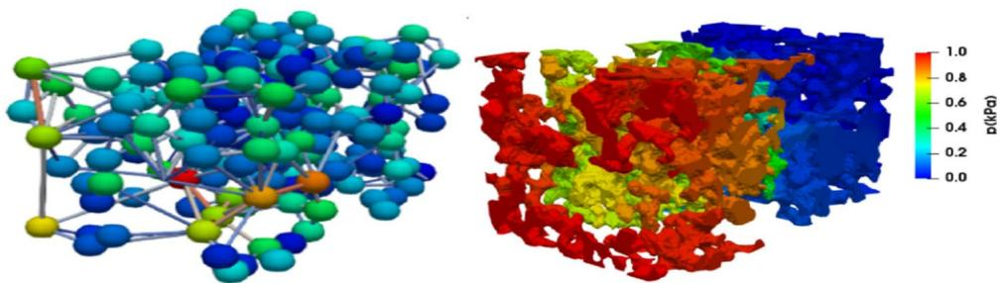  
Fig.16 Examples of fuid fow behaviors and permeability analysis (Tembely et al. 2021; Fu et al. 2023; Jiang et al. 2023)

Challenges for interpretability and quantifcation: The computation complexity and convergence of diferent ML and DL models are signifcantly afected by the required large amount of high-resolution digital images of rocks, which needs large computation resources for analysis and makes it difcult to understand the internal computation complexity of ML and DL models, and the prediction uncertainties of rock segmentation results. Thus, it is still challengeable for the high interpretability and prediction uncertainties for various ML and DL segmentation algorithms.

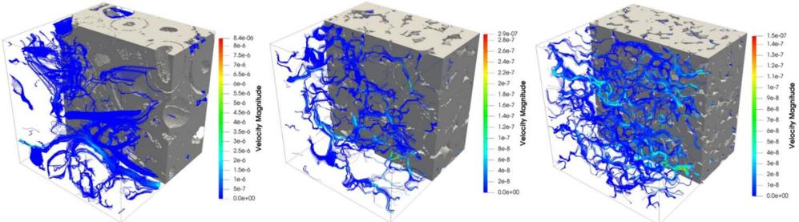  
(a) Fluid flow behaviors in pore network of rocks

(b) Pore-scale permeability and fluid flow behaviors of rocks

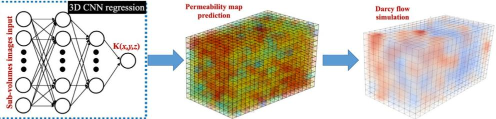  
(c) Permeability and fluid flow behaviors predictions of rocks by deep learning

# 6.4 Future Directions of DL and ML Segmentation Techniques

ML and DL-based segmentation algorithms have signifcantly advanced rock analysis, enabling automated and accurate characterization of geological features. While traditional ML algorithms ofer interpretability and computational efciency, DL algorithms, particularly CNNs, expertize in learning complex features directly from raw rock digital image datasets. The hybrid ML-DL techniques provide a promising direction for further improving rock segmentation accuracy and efciency. Future research in this feld should focus on dealing with challenges such as limited training data, domain adaptation, and generalization across diferent rock types and imaging modalities, which is further described as follows.

Increasing database of diverse rocks: Rocks have different features under diferent imaging resolutions, and rock type diversity also make it challengeable for multiscale characterizations of rocks by diferent heterogeneous microstructures. The primary method to increase the database applies diferent imaging methods (e.g., optical microscopy, SEM, X-ray CT or their combined methods) under diferent resolutions to provide as many digital images as possible, which can add complementary information into various ML and DL models for high accuracy and comprehensive segmentation. Thus, increasing database from various rocks can improve the segmentation accuracy, computation efciency, generalization and interpretability of various ML and DL models with large-scale training data.

Embedding novel techniques to various ML and DL models: To largely improve the segmentation accuracy, computation efciency and generalization, novel techniques, such as edge computing and augmented reality, can be embedded into various ML and DL models. Employing advanced neural network architecture (e.g., transformer models and graph neural network) is the easiest way to improve the performance of ML and DL models. Meanwhile, it is also efective to develop computationally efcient and scalable ML and DL algorithms for the RDIS process using weakly-supervised learning, unsupervised learning, transfer learning and efective domain adaptation algorithms with edge computing and augmented reality to improve the performance of ML and DL models, which can largely increase the accuracy, efciency, convergence and interpretability of segmentation model for multiscale rocks.

Integrating diverse segmentation models with other geological analyses: Exactly, the heterogeneous structures with various pores, cracks and even faults in rocks at diferent scales are extremely related to various mechanical, hydraulic, thermal and chemical properties of rocks, which can be determined by various ML and DL segmentation models. Thus, exploring novel methods combining various ML and DL segmentation and the other geological analysis techniques such as 3D modeling and numerical simulation can enable researchers to deep understand various properties and behaviors of rocks under multiscale and multi-physics conditions.

Multiscale segmentation techniques of rocks with different structures: In fact, the rocks would display diferent structure features, how to distinguish the multiscale characteristics of rocks is still challengeable, especially for features from nanoscale pore structures, microscale pore and crack structures to macroscale fractures and fracture networks even faults, which extremely afects the 3D realistic modeling and property evaluations of rock reservoirs. Therefore, establishing excellent multiscale segmentation techniques of rocks is crucial, and it would make great progress of rock reservoir property evaluations once the advanced ML and DL based multiscale segmentation techniques of rocks are developed and applied in deep reservoir resources exploitation such as shale-gas, oil and geothermal energy.

# 7 Summaries and Conclusions

In this review, various ML, DL and hybrid ML-DL segmentation algorithms are comprehensively evaluated, and their corresponding applications on the petro-physical parameter evaluations, realistic 3D modeling, cracking behaviors and failure mechanism, and transport and fuid fow behaviors analyses of multiscale rocks are detailedly discussed. The main conclusions are drawn as follows.

(1) The defned terms of multiscale rocks can be extensively applied in the digital analysis framework of segmentation procedures with uniformly clear characterizations of multiscale rocks, which provides uniform standard to characterize rocks at diferent scales.

(2) ML-based segmentation algorithms ofer higher interpretability and computational efciency. DL-based segmentation algorithms, such as CNNs, particularly expertize in dealing with complex diverse features directly from rock digital image datasets. The hybrid ML-DL techniques emerge as promising tools to improve segmentation accuracy and efciency of multiscale rocks.

(3) The ML, DL and hybrid ML-DL segmentation techniques can improve the intelligence evaluation degrees of various rock properties such as petro-physical parameters, realistic 3D modeling, cracking behaviors and failure mechanism, and can be applied to accurately predict the performances and accuracy of various rock engineering such as the productions of deep rock reservoir resources and the risks of tunnel excavation and underground space exploitations.

(4) The future study directions of ML and DL segmentation techniques can mainly focus on increasing the data diversity of rock image dataset, developing novel ML and DL-based segmentation models by using advanced neural network architectures and novel learning techniques such as transfer learning and efective domain adaptation algorithms, which can provide signifcant advancements in segmentation accuracy, computation efficiency, interpretability and practical prediction evaluations of various ML, DL and hybrid ML-DL segmentation techniques.

Acknowledgements The work is supported by the National Natural Science Foundation of China (Nos. 42207193, 52027814), the National Key Research and Development Program of China (No. 2023YFC2907200) and the Natural Science Foundation of Chongqing, China (No.2023NSCQ-MSX3411).

Author contributions Zhi Zhao: Writing-original draft, Writingreview & editing, Visualization, Validation, Methodology, Conceptualization, Funding acquisition. Xiao-Ping Zhou: Supervision, Formal analysis, Conceptualization. Writing-review & editing, Funding acquisition.

Funding National Natural Science Foundation of China,42207193,Zhi Zhao,52027814,Zhou Xiao-Ping,National Key Research and Development Program of China,2023YFC2907200,Zhou Xiao-Ping,Natural Science Foundation of Chongqing,2023NSCQ-MSX3411,Zhou Xiao-Ping

Data Availability Data sharing is not applicable to this article, as no datasets were generated or analyzed during the current study.

Code Availability No source code is used in this work.

# Declarations

Conflict of Interest The authors declare there are no conficts of competing interest.

# References

Abdi H, Williams LJ (2010) Principal component analysis. Wiley Interdis Rev 2(4):433–459   
Ali S, Li J, Pei Y, Khurram R, Rehman KU, Mahmood T (2022) A comprehensive survey on brain tumor diagnosis using deep learning and emerging hybrid techniques with multi-modal MR image. Arch Comput Method Eng 29(7):4871–4896   
Andrä H, Combaret N, Dvorkin J, Glatt E, Han J, Kabel M, Keehm Y, Krzikalla F, Lee M, Madonna C, Marsh M, Mukerji T, Saenger E, Sain R, Saxena N, Ricker S, Wiegmann A, Zhan X (2013) Digital rock physics benchmarks—Part II: Computing efective properties. Comp Geosci 50(1):33–43   
Aven T (2016) Risk assessment and risk management: review of recent advances on their foundation. Eur J Oper Res 253(1):1–13   
Azmi SS, Baliga S (2020) An overview of boosting decision tree algorithms utilizing adaboost and XGboost boosting strategies. Intern Res J Eng Techn 7(5):6867–6870   
Bai L, Wei X, Liu Y, Wu C, Chen L (2019) Rock thin section image recognition and classifcation based on VGG model. Geol Bull China 38(12):2053–2058   
Bellens S, Guerrero P, Vandewalle P, Dewulf W (2024) Machine learning in industrial x-ray computed tomography—a review. CIRP J Manuf Sci Technol 51:324–341   
Bentéjac C, Csörgő A, Martínez-Muñoz G (2021) A comparative analysis of gradient boosting algorithms. Artif Intell Rev 54:1937–1967   
Bhatti UA, Tang H, Wu G, Marjan S (2023) Deep learning with graph convolutional networks: an overview and latest applications in computational intelligence. Int J Intell Syst 1:8342104   
Borders WA, Akima H, Fukami S, Moriya S, Kurihara S, Horio Y, Sato S, Ohno H (2016) Analogue spin-orbit torque device for artifcial-neural-network-based associative memory operation. Appl Phys Express 10(1):013007   
Brooks JP (2011) Support vector machines with the ramp loss and the hard margin loss. Oper Res 59(2):467–479   
Byun H, Kim J, Yoon D, Kang IS, Song JJ (2021) A deep convolutional neural network for rock fracture image segmentation. Earth Sci Inf 14:1937–1951   
Canny J (1986) A computational approach to edge detection. Trans Pattern Anal Mach Intell 8(6):679–698   
Cao J, Kwong S, Wang R (2012) A noise-detection based adaboost algorithm for mislabeled data. Pattern Recogn 45(12):4451–4465   
Chang CI (2003) Hyperspectral imaging: techniques for spectral detection and classifcation. Springer Science & Business Media, France   
Charbuty B, Abdulazeez A (2021) Classifcation based on decision tree algorithm for machine learning. J Appl Sci Technol Trend 2(1):20–28   
Chen B, Xiang J, Latham JP, Bakker RR (2020) Grain-scale failure mechanism of porous sandstone: an experimental and numerical FDEM study of the Brazilian Tensile Strength test using CT-Scan microstructure. Int J Rock Mech Min Sci 132:104348   
Chen C, Qin C, Ouyang C, Li Z, Wang S, Qiu H, Chen L, Tarroni G, Bai W, Rueckert D (2022) Enhancing MR image segmentation with realistic adversarial data augmentation. Med Image Anal 82:102597   
Chen GP, Zhao Y, Dai Y, Zhang JX, Yin XT, Cui L, Qian J (2023) Asymmetric U-shaped network with hybrid attention mechanism for kidney ultrasound images segmentation. Expert Syst Appl 212:118847   
Chen LC, Papandreou G, Kokkinos I, Murphy K, Yuille AL (2017) DeepLab: semantic image segmentation with deep convolutional nets, atrous convolution, and fully connected CRFs. Trans Pattern Anal Mach Intell 40(4):834–848   
Cho K, Van Merriënboer B, Gulcehre C, Bahdanau D, Bougares F, Schwenk H, Bengio Y (2014) Learning Phrase Representations Using RNN Encoder-Decoder for Statistical Machine Translation. arXiv preprint arXiv:1406.1078.   
Cho SW, Baek NR, Koo JH, Arsalan M, Park KR (2020) Semantic segmentation with low light images by modifed cyclegan-based image enhancement. Access 8:93561–93585   
Cieslak MC, Castelfranco AM, Roncalli V, Lenz PH, Hartline DK (2020) t-distributed stochastic neighbor embedding (t-SNE): a tool for eco-physiological transcriptomic analysis. Mar Genomics 51:100723   
Clifton J, Laber E (2020) Q-Learning: theory and applications. Ann Rev Stat Appl 7:279–301   
Cnudde V, Boone MN (2013) High-resolution X-ray computed tomography in geosciences: a review of the current technology and applications. Earth Sci Rev 123:1–17   
Cordasco G, Gargano L (2012) Label propagation algorithm: a semisynchronous approach. Intern J Soc Net Min 1(1):3–26   
Cormen TH, Leiserson CE, Rivest RL, Stein C (2009) Introduction to algorithms, 3rd edn. The MIT Press, France   
Cortes C, Vapnik V (1995) Support-vector network. Mach Learn 20:273–297   
Creswell A, White T, Dumoulin V, Arulkumaran K, Sengupta B, Bharath AA (2018) Generative adversarial networks: an overview. IEEE Signal Process Mag 35(1):53–65   
Dhruv P, Naskar S (2020) Image classifcation using convolutional neural network (CNN) and recurrent neural network (rnn): a review. Mach Learn Inform Process 2019:367–381   
Ding S, Zhu Z, Zhang X (2017) An overview on semi-supervised support vector machine. Neural Comput Appl 28:969–978   
Dolz J, Desrosiers C, Ayed IB (2018) 3D fully convolutional networks for subcortical segmentation in MRI: a large-scale study. Neuroimage 170:456–470   
Du G, Cao X, Liang J, Chen X, Zhan Y (2020) Medical image segmentation based on U-Net: a review. J Imag Sci Technol. https://doi. org/10.2352/J.ImagingSci.Technol.2020.64.2.020508   
Duan G, Zhang J, Zhang S (2020) Assessment of landslide susceptibility based on multiresolution image segmentation and geological factor ratings. Int J Environ Res Public Health 17(21):7863   
Durgadevi M (2021) Generative Adversarial Network (GAN): A General Review on Diferent Variants of GAN and Applications. 2021 6th International Conference on Communication and Electronics Systems (ICCES) 1–8.   
El Kouni IB, Karoui W, Romdhane LB (2020) Node importance based label propagation algorithm for overlapping community detection in networks. Expert Syst Appl 162:113020   
Everingham M, Van Gool L, Williams CK, Winn J, Zisserman A (2010) The pascal visual object classes (VOC) challenge. Int J Comput Vision 88(2):303–338   
Fu H, Meng D, Li W, Wang Y (2021) Bridge crack semantic segmentation based on improved deeplabv3+. J Mar Sci Eng 9(6):671   
Fu J, Haeri H, Sarfarazi V, Rahmani A, Salehipour P, Tabaroei A, Shangguan LJ (2024) Investigating tensile failure mechanisms of layered rocks through physical testing and PFC3D analysis. Eng Fract Mech 311:110541   
Fu J, Wang M, Chen B, Wang J, Xiao D, Luo M, Evans B (2023) A data-driven framework for permeability prediction of natural porous rocks via microstructural characterization and pore-scale simulation. Eng Comp 39(6):3895–3926   
Ghiasi-Shirazi K, Safabakhsh R, Shamsi M (2010) Learning translation invariant kernels for classifcation. J Mach Learn Res 11(4):1353–1390   
Gonzalez RC, Woods RE (2008) Digital image processing. Prentice Hall   
Govindan R, Korre A, Durucan S, Imrie CE (2011) A geostatistical and probabilistic spectral image processing methodology for monitoring potential CO2 leakages on the surface. Int J Greenhouse Gas Control 5(3):589–597   
Graves A (2012) Long short-term memory. Supervised sequence labelling with recurrent neural networks berlin, Heidelberg   
Gu Y, Ge Z, Bonnington CP, Zhou J (2019) Progressive transfer learning and adversarial domain adaptation for cross-domain skin disease classifcation. J Biomed Health Inform 24(5):1379–1393   
Guan H, Liu M (2021) Domain adaptation for medical image analysis: a survey. Trans Biomed Eng 69(3):1173–1185   
Guo BE, Xiao N, Martyushev D, Zhao Z (2024) Deep learningbased pore network generation: Numerical insights into pore geometry efects on microstructural fuid fow behaviors of unconventional resources. Energy 294:130990   
Guo MH, Xu TX, Liu JJ, Liu ZN, Jiang PT, Mu TJ, Zhang S, Martin R, Cheng M, Hu SM (2022) Attention mechanisms in computer vision: a survey. ComputVisual Media 8(3):331–368   
Haeri H, Sarfarazi V, Zhou L, Karimi Javid H, Asgari K, Elahi A (2025) Evaluation of rock pillar failure mechanisms under uniaxial compression: impact of joint number and joint angle. Comput Particle Mech 12(1):205–230   
Hafz AM (2022) Image classifcation by reinforcement learning with two-state Q-learning. Handbook of intelligent computing and optimization for sustainable development Wiley, France   
Haji SH, Abdulazeez AM (2021) Comparison of optimization techniques based on gradient descent algorithm: a review. PalArch J Archaeol Egypt 18(4):2715–2743   
Hancock JT, Khoshgoftaar TM (2020) CatBoost for big data: an interdisciplinary review. J Big Data 7(1):94   
Hansel K, Moos J, Derstrof C (2021) Benchmarking the Natural Gradient in Policy Gradient Methods and Evolution Strategies. Reinforcement Learning Algorithms: Analysis and Applications 69–84.   
Haralick RM, Shanmugam K, Dinstein IH (1973) Textural features for image classifcation. Trans Syst Man Cybern 3(6):610–621   
Hochreiter S, Schmidhuber J (1997) Long short-term memory. Neural Comput 9(8):1735–1780   
Hou J, Gao H, Li X (2016) DSets-DBSCAN: a parameter-free clustering algorithm. Trans Image Process 25(7):3182–3193   
Hu R, Jia W, Ling H, Huang D (2012) Tone mapping for blood vessel segmentation in retinal images. Comput Biol Med 42(12):1162–1171   
Huang H, Wu C, Zhou M, Chen J, Han T, Zhang L (2024) Rock mass quality prediction on tunnel faces with incomplete multi-source dataset via tree-augmented naive bayesian network. Intern J Min Sci Technol. https://doi.org/10.1016/j.ijmst.2024.03.003   
Huang YJ, Natarajan S, Zhang H, Guo FQ, Xu SL, Zeng C, Zheng ZS (2023) A CT image-driven computational framework for investigating complex 3D fracture in mesoscale concrete. Cement Concr Compos 143:105270   
Hung WC, Tsai YH, Liou YT, Lin YY, Yang MH (2018) Adversarial learning for semi-supervised semantic segmentation. arXiv preprint arXiv:1802.07934.   
Ibrahim AA, Ridwan RL, Muhammed MM, Abdulaziz RO, Saheed GA (2020) Comparison of the CatBoost Classifer With Other Machine Learning Methods. Intern J Adv Comp Sci Appl 11(11).   
Iqbal A, Sharif M, Yasmin M, Raza M, Aftab S (2022) Generative adversarial networks and its applications in the biomedical image segmentation: a comprehensive survey. Intern J MultimInform Retr 11(3):333–368   
Isensee F, Jaeger PF, Kohl SA, Petersen J, Maier-Hein KH (2021) nnUNet: a self-confguring method for deep learning-based biomedical image segmentation. Nat Methods 18(2):203–211   
Jahanbakhsh A, Wlodarczyk KL, Hand DP, Maier RR, Maroto-Valer MM (2020) Review of microfuidic devices and imaging techniques for fluid flow study in porous geomaterials. Sensors 20(14):4030   
Jiang F, Guo Y, Tsuji T, Kato Y, Shimokawara M, Esteban L, Seyyedi M, Pervukhina M, Lebedev M, Kitamura R (2023) Upscaling permeability using multiscale X-ray-CT images with digital rock modeling and deep learning techniques. Water Res Res. https:// doi.org/10.1029/2022WR033267   
Jiao W, Hao X, Qin C (2021) The image classifcation method with CNN-XGBoost model based on adaptive particle swarm optimization. Information 12(4):156   
Jin T, Ye XW, Li ZX (2023) Establishment and evaluation of conditional GAN-based image dataset for semantic segmentation of structural cracks. Eng Struct 285:116058   
Jollife IT (2002) Principal component analysis. Springer   
Kang J, Feng S (2022) Pavement cracks segmentation algorithm based on conditional generative adversarial network. Sensors 22(21):8478   
Kawakami K (2008) Supervised sequence labelling with recurrent neural networks (Doctoral dissertation).   
Ke G, Meng Q, Finley T, Wang T, Chen W, Ma W, Liu TY (2017) LightGBM: a highly efcient gradient boosting decision tree. Adv Neur Inform Proces Sys 30.   
Khadka R, Jha D, Hicks S, Thambawita V, Riegler MA, Ali S, Halvorsen P (2022) Meta-learning with implicit gradients in a fewshot setting for medical image segmentation. Comput Biol Med 143:105227   
Kingma DP, Ba J (2014) Adam: a method for stochastic optimization. arXiv preprint arXiv:1412.6980.   
Kodinariya TM, Makwana PR (2013) Review on determining number of cluster in K-means clustering. Int J 1(6):90–95   
Kohonen T (1990) The self-organizing map. Proc 78(9):1464–1480   
Kora P, Ooi CP, Faust O, Raghavendra U, Gudigar A, Chan WY, Acharya UR (2022) Transfer learning techniques for medical image analysis: a review. Biocybern Biomed Eng 42(1):79–107   
Kotsiantis SB (2013) Decision trees: a recent overview. Artif Intell Rev 39:261–283   
Krell MM (2018) Generalizing, decoding, and optimizing support vector machine classifcation. arXiv preprint arXiv:1801.04929.   
Kus J (2015) Application of confocal laser-scanning microscopy (CLSM) to autofuorescent organic and mineral matter in peat, coals and siliciclastic sedimentary rocks—a qualitative approach. Int J Coal Geol 137:1–18   
LaValley MP (2008) Logistic reg ression. Circulation 117(18):2395–2399   
Lepistö L, Kunttu I, Visa A (2006) Rock image classification based on k-nearest neighbour voting. Proceed Image Signal 153(4):475–482   
Li S, Hou S (2024) A machine learning method of accelerating multiscale analysis for spatially varying microstructures. Int J Mech Sci 266:108952   
Li X, Li B, Liu F, Li T, Nie X (2023) Advances in the application of deep learning methods to digital rock technology. Adv GeoEnergy Res 8(1):5–18   
Li Z, Kang Y, Feng D, Wang XM, Lv W, Chang J, Zheng WX (2020) Semi-supervised learning for lithology identifcation using laplacian support vector machine. J Petrol Sci Eng 195:107510   
Li ZS, Yao X, Liu ZG, Zhang JC (2021) Feature selection algorithm based on lightGBM. J Northeast Uni 42(12):1688   
Lin Y, Lai Z, Ma J, Huang L (2024) A combined weighted Voronoi tessellation and random feld approach for modeling heterogeneous rocks with correlated grain structure. Constr Build Mater 416:135228   
Liu C, Chen LC, Schrof F, Adam H, Hua W, Yuille AL, Fei-Fei L (2019) Auto-DeepLab: hierarchical neural architecture search for semantic image segmentation. Proceedings of the IEEE/CVF Conference on computer vision and pattern recognition 82–92.   
Liu M, Wang S, Guo Y, He Y, Xue H (2021) Pano-SfMLearner: selfsupervised multi-task learning of depth and semantics in panoramic videos. Signal Process Lett 28:832–836   
Liu Y, Qiao J, Han T, Li L (2020) A 3D image reconstruction model for long tunnel geological estimation. J Adv Transp 1:8846955   
Liu Y, Wang X, Zhang Z, Deng F (2023a) Deep learning in image segmentation for mineral production: a review. Comp Geosci. https://doi.org/10.1016/j.cageo.2023.105455   
Liu Y, Zhang D, Lu G (2008) Region-based image retrieval with highlevel semantics using decision tree learning. Pattern Recogn 41(8):2554–2570   
Liu Y, Zhu R, Zhai S, Li N, Li C (2023b) Lithofacies identifcation of shale formation based on mineral content regression using lightgbm algorithm: a case study in the luzhou block, South Sichuan Basin. China Energy Sci Eng 11(11):4256–4272   
Liu Z, Ma C, Wei XA (2022) Electron scanning characteristics of rock materials under diferent loading methods: a review. Geomech Geophy Geo-Energ Geo-Res 8(2):80   
Lu H, Mazumder R (2020) Randomized gradient boosting machine. J Optim 30(4):2780–2808   
Lu J, Ouyang X, Shen X, Liu T, Cui Z, Wang Q, Shen D (2022) GAN-guided deformable attention network for identifying thyroid nodules in ultrasound images. J Biomed Health Inform 26(4):1582–1590   
Ma B, Zhao Y, Yang Y, Zhang X, Dong X, Zeng D, Ma S, Li S (2020) MRI image synthesis with dual discriminator adversarial learning and difculty-aware attention mechanism for hippocampal subfelds segmentation. Comput Med Imaging Graph 86:101800   
Ma C, Xue D, Li S, Zhou Z, Zhu Y, Guo X (2022) Compliance minimisation of smoothly varying multiscale structures using asymptotic analysis and machine learning. Comput Methods Appl Mech Eng 395:114861   
Ma GW, Xu ZH, Zhang W, Li SC (2015) An enriched K-means clustering method for grouping fractures with meliorated initial centers. Arab J Geosci 8:1881–1893   
Maiti A, Choudhary A, Chakravarty D (2021) A k-means clustering– based approach for 3D mapping and characterization of rock faces using digital images. Arab J Geosci 14(10):848   
Mallat SG (1989) A theory for multiresolution signal decomposition: the wavelet representation. Trans Pattern Anal Mach Intell 11(7):674–693   
Mandelbrot BB (1982) The Fractal Geometry of Nature. Freeman, W.H   
Manessi F, Rozza A, Manzo M (2020) Dynamic graph convolutional networks. Pattern Recogn 97:107000   
Markaki S, Panagiotakis C (2023) Jigsaw puzzle solving techniques and applications: a survey. Vis Comput 39(10):4405–4421   
Mehmood M, Shahzad A, Zafar B, Shabbir A (2022) Ali N (2022) Remote sensing image classifcation: a comprehensive review and applications. Math Probl Eng 1:5880959   
Mertz J (2019) Introduction to optical microscopy. Cambridge University Press   
Mnih V et al (2015) Human-level control through deep reinforcement learning. Nature 518:529–533   
Mohammed AI, Oyeneyin B, Atchison B, Njuguna J (2019) Casing structural integrity and failure modes in a range of well types-a review. J Natural Gas Sci Eng 68:102898   
Murtagh F, Contreras P (2012) Algorithms for hierarchical clustering: an overview. Wiley Interdisc Rev 2(1):86–97   
Natekin A, Knoll A (2013) Gradient boosting machines, a tutorial. Front Neurorobot 7:21   
Nichol JE, Shaker A, Wong MS (2006) Application of high-resolution stereo satellite images to detailed landslide hazard assessment. Geomorphology 76(1–2):68–75   
Nosouhian S, Nosouhian F, Khoshouei AK (2021) A review of recurrent neural network architecture for sequence learning: Comparison between LSTM and GRU.   
Ojala T, Pietikäinen M, Mäenpää T (2002) Multiresolution gray-scale and rotation invariant texture classifcation with local binary patterns. Trans Pattern Anal Mach Intell 24(7):971–987   
Osman YBM, Li C, Huang W, Wang S (2023) Collaborative learning for annotation-efcient volumetric MR image segmentation. J Magn Reson Imag. https://doi.org/10.1002/jmri.29194 Pan D, Li Y, Wang X, Xu Z (2024) Intelligent image-based identifcation and 3-D reconstruction of rock fractures: Implementation and application. Tunn Undergr Space Technol 145:105582 Park J, Kim Y, Kim SS, Kim KY, Yun TS (2024) Efect of injection rate and viscosity on stimulated fracture in granite: extraction of fracture by convolutional neural network and morphological analysis. Rock Mech Rock Eng 57(3):2159–2174 Park S, Jeong W, Moon YS (2020) X-ray image segmentation using multi-task learning. Transact Intern Informat Sys   
14(3):1104–1120 Patel S, Sutaria S, Daga R, Shah M, Prajapati M (2023) A systematic study on complementary metal-oxide semiconductor technology (CMOS) and internet of things (IOT) for radioactive leakage detection in nuclear plant. Nuclear Anal 2(3):100080 Pi Z, Zhou Z, Li X, Wang S (2021) Digital image processing method for characterization of fractures, fragments, and particles of soil/ rock-like materials. Mathematics 9(8):815 Pickup G, Marks A (2000) Identifying large-scale erosion and deposition processes from airborne gamma radiometrics and digital elevation models in a weathered landscape. Earth Surf Proc Land   
25(5):535–557 Pinaya WHL, Vieira S, Garcia-Dias R, Mechelli A (2020) Autoencoders. In: Machine learning. Academic Press, 193–208. Powers DM (2011) evaluation: from precision, recall and F-measure to ROC, informedness, markedness and correlation. J Mach Learn Technol 2(1):37–63 Prokhorenkova L, Gusev G, Vorobev A, Dorogush AV, Gulin A (2018) CatBoost: unbiased boosting with categorical features. Adv Neural InformProces Sys 31. Purswani P, Karpyn ZT, Enab K, Xue Y, Huang X (2020) Evaluation of image segmentation techniques for image-based rock property estimation. J Petrol Sci Eng 195:107890 Qafou I (2023) Efcient parameter estimation in image processing using a multi-agent hysteretic Q-learning approach. Intern J Adv Comp SciAppl. https://doi.org/10.14569/IJACSA.2023.0140828 Raikwal JS, Saxena K (2012) Performance evaluation of SVM and k-nearest neighbor algorithm over medical data set. Intern J Comp Appl. https://doi.org/10.5120/7842-1055 Rana M, Bhushan M (2023) Machine learning and deep learning approach for medical image analysis: diagnosis to detection. Multimed Tools Applicat 82(17):26731–26769 Rao T, Li X, Zhang H, Xu M (2019) Multi-level region-based convolutional neural network for image emotion classifcation. Neurocomputing 333:429–439 Reddy YCAP, Viswanath P, Reddy BE (2018) Semi-supervised learning: a brief review. Int J Eng Technol. https://doi.org/10.14419/ ijet.v7i1.8.9977 Reynolds DA (2009) Gaussian mixture models. Encyclop Biomet   
741:659–663 Ruder S (2016) An overview of gradient descent optimization algorithms. arXiv preprint arXiv:1609.04747. Rumelhart DE, Hinton GE, Williams RJ (1986) Learning internal representations by error propagation, parallel distributed processing, explorations in the microstructure of cognition, ed. DE Rumelhart and J. McClelland. Vol. 1. 1986. Biometrika 71:599–607 Samat A, Li E, Du P, Liu S, Xia J (2021) GPU-accelerated CatBoostforest for hyperspectral image classifcation via parallelized mRMR ensemble subspace feature selection. J Sel Top Appl Earth Observ Remote Sens 14:3200–3214 Saxena N, Mavko G (2016) Estimating elastic moduli of rocks from thin sections: digital rock study of 3D properties from 2D images. Comput Geosci 88:9–21 Saxena N, Mavko G, Hofmann R, Srisutthiyakorn N (2017) Estimating permeability from thin sections without reconstruction: digital rock study of 3D properties from 2D images. Comput Geosci   
102:79–99   
Schlögel R et al (2018) Optimizing landslide susceptibility zonation: Efects of DEM spatial resolution and slope unit delineation on logistic regression models. Geomorphology 301:10–20   
Schwenker F (2013) Ensemble methods: foundations and algorithms [book review]. Comput Intell Mag 8(1):77–79   
Sharma N et al (2008) Segmentation and classifcation of medical images using texture-primitive features: application of BAMtype artifcial neural network. J Med Phys 33(3):119–126   
Shehata M, Elhosseini M (2024) Charting new frontiers: insights and future directions in ML and DL for image processing. Electronics 13(7):1345   
Shetty P, Singh S (2021) Hierarchical clustering: a survey. Int J Appl Res 7(4):178–181   
Shi J, Gong T, Wang C, Li C (2022) Semi-supervised pixel contrastive learning framework for tissue segmentation in histopathological image. J Biomed Health Inform 27(1):97–108   
Shiri FM, Perumal T, Mustapha N, Mohamed R (2023) A comprehensive overview and comparative analysis on deep learning models: CNN, RNN, LSTM. GRU Arxiv Preprint arXiv 2305:17473   
Shou YD, Zhao Z, Zhou XP (2020) Sensitivity analysis of segmentation techniques and voxel resolution on rock physical properties by X-ray imaging. J Struct Geol 133:103978   
Shurrab S, Duwairi R (2022) Self-supervised learning methods and applications in medical imaging analysis: a survey. PeerJ Comp Sci 8:e1045   
Siddique N, Paheding S, Elkin CP, Devabhaktuni V (2021) U-net and its variants for medical image segmentation: a review of theory and applications. Access 9:82031–82057   
Singh N, Singh TN, Tiwary A, Sarkar KM (2010) Textural identifcation of basaltic rock mass using image processing and neural network. Comput Geosci 14:301–310   
Singh SK, Banerjee BP, Raval S (2023) A review of laser scanning for geological and geotechnical applications in underground mining. Int J Min Sci Technol 33(2):133–154   
Soille P (2013) Morphological image analysis: principles and applications. Springer Science & Business Media, France   
Song Z, Yang X, Xu Z, King I (2022) Graph-based semi-supervised learning: a comprehensive review. IEEE Transactions on Neural Networks and Learning Systems. https://doi.org/10.1109/ TNNLS.2022.3155478   
Sperandei S (2014) Understanding logistic regression. Anal Biochemia Medica 24(1):12–18   
Stember JN, Shalu H (2022) Reinforcement learning using Deep Q Networks and Q learning accurately localizes brain tumors on MRI with very small training sets. Med Imag 22(1):224   
Sumiea EH, Abdulkadir SJ, Alhussian HS, Al-Selwi SM, Alqushaibi A, Ragab MG, Fati SM (2024) Deep deterministic policy gradient algorithm: a systematic review. Heliyon 10:e30697   
Sun J, Li C, Wang Z, Wang Y (2023) A memristive fully connect neural network and application of medical image encryption based on central difusion algorithm. IEEE Transactions on Industrial Informatics.   
Sun X, Song P, Zhao C, Zhang Y, Li G, Miao C (2018) Physical modeling experimental study on failure mechanism of surrounding rock of deep-buried soft tunnel based on digital image correlation technology. Arab J Geosci 11:1–13   
Sun Y, Ding S, Guo L, Zhang Z (2022) Hypergraph regularized semisupervised support vector machine. Inf Sci 591:400–421   
Tang R, Song W, Guan X, Ge H, Kong D (2020) Dam Burst: A regionmerging-based image segmentation method. arXiv preprint arXiv:2003.04797.   
Tasar O, Tarabalka Y, Giros A, Alliez P, Clerc S (2020) StandardGAN: Multi-source domain adaptation for semantic segmentation of very high resolution satellite images by data standardization. In Proceedings of the IEEE/CVF Conference on Computer Vision and Pattern Recognition Workshops 192–193.   
Tembely M, AlSumaiti AM, Alameri WS (2021) Machine and deep learning for estimating the permeability of complex carbonate rock from X-ray micro-computed tomography. Energy Rep 7:1460–1472   
Toldo M, Maracani A, Michieli U, Zanuttigh P (2020) Unsupervised domain adaptation in semantic segmentation: a review. Technologies 8(2):35   
Ural N (2021) The signifcance of scanning electron microscopy (SEM) analysis on the microstructure of improved clay: an overview. Open Geosci 13(1):197–218   
Van der Meer FD (2006) The efectiveness of spectral similarity measures for the analysis of hyperspectral imagery. Int J Appl Earth Obs Geoinf 8(1):3–17   
Vesal S, Gu M, Kosti R, Maier A, Ravikumar N (2021) Adapt everywhere: unsupervised adaptation of point-clouds and entropy minimization for multi-modal cardiac image segmentation. Trans Med Imaging 40(7):1838–1851   
Walicka A, Jóźków G, Borkowski A (2018) Individual rocks segmentation in terrestrial laser scanning point cloud using iterative DBSCAN algorithm. Int Arch Photog Remote Sens Spat Inf Sci 42:1157–1161   
Wang A, Islam M, Xu M, Ren H (2023) Curriculum-based augmented fourier domain adaptation for robust medical image segmentation. IEEE Transactions on Automation Science and Engineering.   
Wang D, Hu M (2021) Deep deterministic policy gradient with compatible critic network. Trans Neural Netw Learn Syst 34(8):4332–4344   
Wang J, Zheng J, Lü Q, Guo J, He M, Deng J (2020) A multidimensional clustering analysis method for dividing rock mass homogeneous regions based on the shape dissimilarity of trace maps. Rock Mech Rock Eng 53:3937–3952   
Wang R (2012) AdaBoost for feature selection, classifcation and its relation with SVM, a review. Phys Procedia 25:800–807   
Wang W, Sun D (2021) The improved AdaBoost algorithms for imbalanced data classifcation. Inf Sci 563:358–374   
Wang W, Wang S, Li Y, Jin Y (2021a) Adaptive multi-scale dual attention network for semantic segmentation. Neurocomputing 460:39–49   
Wang X, Zhang H, Yin ZY, Su D, Liu Z (2023b) Deep-learningenhanced model reconstruction of realistic 3D rock particles by intelligent video tracking of 2D random particle projections. Acta Geotech 18(3):1407–1430   
Wang Y, Cheng J, Chen Y, Shao S, Zhu L, Wu Z, Liu T, Zhu H (2023d) Fvp: Fourier visual prompting for source-free unsupervised domain adaptation of medical image segmentation. Transact Med Imag. https://doi.org/10.1109/TMI.2023.3306105   
Wang Y, Gao L, Hong D, Sha J, Liu L, Zhang B, Rong X, Zhang Y (2021b) Mask DeepLab: end-to-end image segmentation for change detection in high-resolution remote sensing images. Int J Appl Earth Obs Geoinf 104:102582   
Wang Y, Sun S (2022) A rock fabric classifcation method based on the grey level co-occurrence matrix and the Gaussian mixture model. J Natural Gas Sci Eng 104:104627   
Wang Z, Bovik AC, Sheikh HR, Simoncelli EP (2004) Image quality assessment: from error visibility to structural similarity. IEEE Trans Image Process 13(4):600–612   
Wang Z, Yang C, Oh SK, Fu Z (2018) Multi-radial basis function SVM classifer: design and analysis: design and analysis. J Elect Eng Techn 13(6):2511–2520   
Wang Z, Zou Y, Liu PX (2021c) Hybrid dilation and attention residual U-Net for medical image segmentation. Comput Biol Med 134:104449   
Weerakody PB, Wong KW, Wang G, Ela W (2021) A review of irregular time series data handling with gated recurrent neural networks. Neurocomputing 441:161–178   
Weiss K, Khoshgoftaar TM, Wang D (2016) A survey of transfer learning. Journal of Big Data 3:1–40   
Wennberg OP, Rennan L (2018) A brief introduction to the use of X-ray computed tomography (CT) for analysis of natural deformation structures in reservoir rocks.   
Wu J, Liu B, Zhang H, He S, Yang Q (2021) Fault detection based on fully convolutional networks (FCN). J Marine Sci Eng 9(3):259   
Wu Q, Zhou DX (2005) SVM soft margin classifers: linear programming versus quadratic programming. Neural Comput 17(5):1160–1187   
Wu Y, Zeng D, Wang Z, Shi Y, Hu J (2022) Distributed contrastive learning for medical image segmentation. Med Image Anal 81:102564   
Xie C, Zhu J, Wang J, Yang J, Song H (2023) Direct prediction of relative permeability curve from 3D digital rock images based on deep learning approaches. Int J Rock Mech Min Sci 170:105544   
Xue Y, Xu T, Zhang H, Long LR, Huang X (2018) Segan: Adversarial network with multi-scale l 1 loss for medical image segmentation. Neuroinformatics 16:383–392   
Yan T, Xu R, Sun SH, Hou ZK, Feng JY (2024) A real-time intelligent lithology identifcation method based on a dynamic felling strategy weighted random forest algorithm. Pet Sci 21(2):1135–1148   
Yang J, Liu J, Li W, Dai J, Xue F, Zhuang X (2024) A multiscale poroelastic damage model for fracturing in permeable rocks. Int J Rock Mech Min Sci 175:105676   
Yang R, Buenfeld NR (2001) Binary segmentation of aggregate in SEM image analysis of concrete. Cem Concr Res 31(3):437–441   
Yang SQ, Chen M, Huang YH, Jing HW, Ranjith PG (2020a) An experimental study on fracture evolution mechanism of a nonpersistent jointed rock mass with various anchorage efects by DSCM, AE and X-ray CT observations. Int J Rock Mech Min Sci 134:104469   
Yang SQ, Yang Z, Jing HW, Xu T (2020b) Fracture evolution mechanism of hollow sandstone under conventional triaxial compression by X-ray micro-CT observations and three-dimensional numerical simulations. Int J Solids Struct 190:156–180   
Yilmaz NG, Yurdakul M, Goktan RM (2007) Prediction of radial bit cutting force in high-strength rocks using multiple linear regression analysis. Int J Rock Mech Min Sci 44(6):962–970   
Yoo H, Kim B, Kim JW, Lee JH (2021) Reinforcement learning based optimal control of batch processes using Monte-Carlo deep deterministic policy gradient with phase segmentation. Comput Chem Eng 144:107133   
Yu Y, Si X, Hu C, Zhang J (2019) A review of recurrent neural networks: LSTM cells and network architectures. Neural Comput 31(7):1235–1270   
Yue C, Wang Y, Tang X, Chen Q (2022) DRGCNN: Dynamic region graph convolutional neural network for point clouds. Expert Syst Appl 205:117663   
Zakaria N, Hassim YMM (2024) A Review Study of the Visual Geometry Group Approaches for Image Classifcation. J Appl Sci Technol Comput 1(1):14–28   
Zhang H, Zhang Z, Zhao M, Ye Q, Zhang M, Wang M (2020a) Robust triple-matrix-recovery-based auto-weighted label propagation for classification. Transact Neural Networks Lear Syst 31(11):4538–4552   
Zhang L, Chen GD, Ba J, Carcione JM, Xu WH, Fang ZJ (2024) Prediction of carbonate permeability from multi-resolution CT scans and deep learning. Appl Geophy. https://doi.org/10.1007/ s11770-024-1142-3   
Zhang M, Li W, Du Q (2018) Diverse region-based CNN for hyperspectral image classifcation. Trans Image Process 27(6):2623–2634   
Zhang P, Jia Y, Shang Y (2022a) Research and application of XGBoost in imbalanced data. Int J Distrib Sens Netw 18(6):15501329221106936   
Zhang X, Liu Y, Guo S, Song Z (2023a) EG-Unet: Edge-Guided cascaded networks for automated frontal brain segmentation in MR images. Comput Biol Med 158:106891   
Zhang Y, Li H, Yang T, Tao R, Liu Z, Shi S, Zhang J, Ma N, Feng W, Zhang Z, Zhang X (2023b) Multi-source adversarial transfer learning for ultrasound image segmentation with limited similarity. Appl Soft Comput 146:110675   
Zhang Y, Ran H, Peng Y, Zheng Y (2020) A novel framework of artifcial intelligent geologic hazards detection over comprehensive remote sensing. In Proceedings of the 6th China High Resolution Earth Observation Conference (CHREOC 2019) 457–470. Springer Singapore.   
Zhang Z, Li Y, Shin BS (2022b) C2-GAN: Content-consistent generative adversarial networks for unsupervised domain adaptation in medical image segmentation. Med Phys 49(10):6491–6504   
Zhao H, Shi J, Qi X, Wang X, Jia J (2017) Pyramid scene parsing network. In Proceedings of the IEEE conference on computer vision and pattern recognition 2881–2890.   
Zhao J, Wang F, Cai J (2021) 3D tight sandstone digital rock reconstruction with deep learning. J Petrol Sci Eng 207:109020   
Zhao P, Zhang J, Fang W, Deng S (2020) SCAU-net: spatial-channel attention U-net for gland segmentation. Front Bioeng Biotechn 8:670   
Zhao T, MacKay S (2020) Segmentation of granitoid and shale core images using support vector machines. Comput Geosci 135:104379   
Zhao Z, Lu HF (2023) Deep learning interprets failure process of coal reservoir during CO2-desorption by 3D reconstruction techniques. Energy 282:128802   
Zhao Z, Zhou XP (2021) DRPCTS: a digital computation theory framework system for rock property parameters using micro-CT images. Int J Numer Anal Meth Geomech 45(13):1934–1948   
Zhao Z, Berto F, Zou YL, Li Z, Zhou XP (2024a) Thermophysical– mechanical properties evaluations of porous geomaterials by CT images and digital–virtual modeling. Fatigue Fract Eng Mater Struct 47(7):2319–2335   
Zhao Z, Shou Y, Zhou X (2023) Microscopic cracking behaviors of rocks under uniaxial compression with microscopic multiphase heterogeneity by deep learning. Int J Min Sci Technol 33(4):411–422   
Zhao Z, Shou YD, Zhou XP (2024b) A novel digital extraction approach of pore network models from carbonates inspired by quantum genetic optimization techniques. Acta Geotech. https:// doi.org/10.1007/s11440-024-02310-2   
Zhao Z, Zhou X, Qian Q (2022a) DQNN: Pore-scale variables-based digital permeability assessment of carbonates using quantum mechanism-based machine-learning. Sci China Technol Sci. https://doi.org/10.1007/s11431-021-1906-1   
Zhao Z, Zhou XP (2019) An integrated method for 3D reconstruction model of porous geomaterials through 2D CT images. Comput Geosci 123:83–94   
Zhao Z, Zhou XP (2022a) Digital analysis for pore-scale compressive strength and permeability of foamed cement with realistic microstructures by X-ray- $\mu \mathrm { C T }$ imaging. Constr Build Mater 346:128456   
Zhao Z, Zhou XP (2022b) Pore-scale difusivity and permeability evaluations in porous geomaterials using multi-types pore-structure analysis and $\mathrm { X - \mu C T }$ imaging. J Hydrol 615:128704   
Zhao Z, Zhou XP (2023a) A novel voxel-particle energy approach to predict 3D microscopic fracture surface of porous geomaterials and fracture permeability modeling. Eng Geol 323:107214   
Zhao Z, Zhou XP (2023b) Investigating efects of pore-scale variables and pore geometries on the thermal behaviors of porous concretes. J Build Eng 75:106895   
Zhao Z, Zhou XP (2024) Digital microscopic multiphase heterogeneity representation and its efects on micromechanics and cracking behaviors of geomaterials. Rock Mechan Rock Eng. https://doi. org/10.1007/s00603-024-03905-7   
Zhao Z, Zhou XP, Chen JW, Qian QH (2022b) Spatial propagation efects of 3D cracks on mechanical properties of Geomaterials under uniaxial compression by 3D reconstruction. Rock Mech Rock Eng 55(11):6761–6778   
Zhou G, Song C, Simmers J, Cheng P (2004) Urban 3D GIS from LiDAR and digital aerial images. Comput Geosci 30(4):345–353   
Zhou L, Fu K, Liu Z, Zhang F, Yin Z, Zheng J (2019) Superpixel based continuous conditional random feld neural network for semantic segmentation. Neurocomputing 340:196–210   
Zhou XP, Jiang DC, Zhao Z (2022) Digital evaluation of micro-pore water efects on mechanical and damage characteristics of sandstone subjected to uniaxial, cyclic loading–unloading compression by 3D reconstruction technique. Rock Mech Rock Eng. https://doi.org/10.1007/s00603-021-02662-1   
Zhou XP, Zhao Z, Liu Y (2020) Digital spatial cracking behaviors of fne-grained sandstone with precracks under uniaxial compression. Int J Numer Anal Meth Geomech 44(13):1770–1787   
Zhu Z, Xu M, Bai S, Huang T, Bai X (2019) Asymmetric non-local neural networks for semantic segmentation. In Proceedings of the IEEE/CVF International Conference on Computer Vision 593–602.   
Zou J, Han Y, So SS (2009) Overview of artifcial neural networks. Method Applicat. https://doi.org/10.1007/978-1-60327-101-1_2

Publisher's Note Springer Nature remains neutral with regard to jurisdictional claims in published maps and institutional afliations.

Springer Nature or its licensor (e.g. a society or other partner) holds exclusive rights to this article under a publishing agreement with the author(s) or other rightsholder(s); author self-archiving of the accepted manuscript version of this article is solely governed by the terms of such publishing agreement and applicable law.